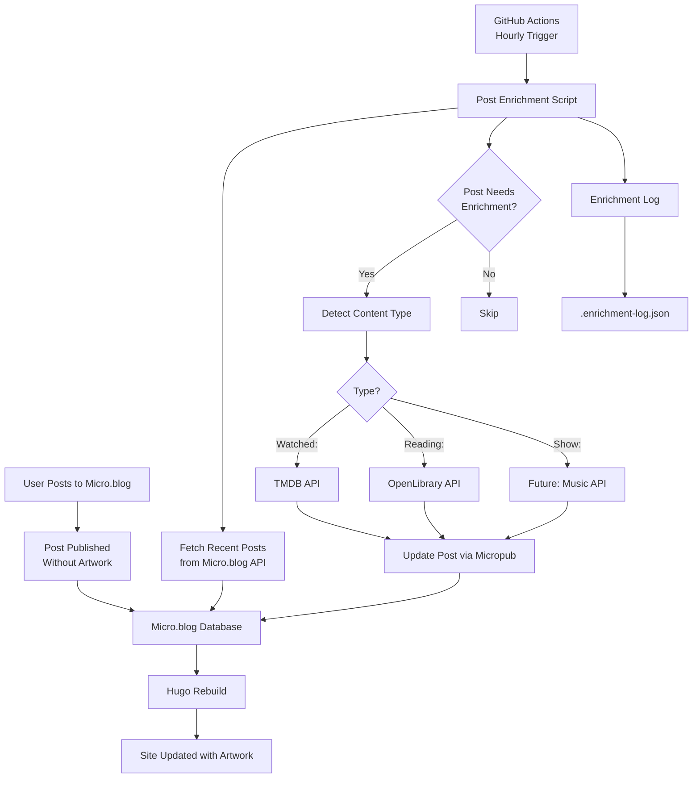

# Post-Facto Enrichment Implementation

**Feature:** Automatic enrichment of Micro.blog posts with artwork and metadata
**Status:** Design Phase
**Target:** Workflow B - Post-facto enrichment of existing posts

---

## Table of Contents

1. [Overview](#overview)
2. [Architecture](#architecture)
3. [Detection Logic](#detection-logic)
4. [Enrichment Sources](#enrichment-sources)
5. [Update Mechanism](#update-mechanism)
6. [Scheduling & Automation](#scheduling--automation)
7. [Logging & Notifications](#logging--notifications)
8. [Error Handling](#error-handling)
9. [Configuration](#configuration)
10. [Testing Strategy](#testing-strategy)
11. [Implementation Checklist](#implementation-checklist)
12. [Acceptance Criteria](#acceptance-criteria)

---

## Overview

### Purpose

Enable users to quickly post content to Micro.blog with content type prefixes ("Watched:", "Reading:", "Show:") and have the middleware automatically enrich these posts with artwork and metadata from external APIs.

### User Workflow

```
1. User posts to Micro.blog: "Watched: The Shawshank Redemption 🍿"
   - Post is published immediately without artwork
   - Theme displays post with graceful fallback (no poster)

2. Middleware runs (hourly via GitHub Actions)
   - Fetches recent posts from Micro.blog
   - Detects "Watched:" prefix
   - Checks if post has `image` field → NO
   - Fetches poster from TMDB API
   - Updates post with image field via Micropub

3. Micro.blog rebuilds site
   - Theme now displays post with movie poster
```

### Benefits

- **Fast posting:** Don't need to find artwork manually
- **Consistent enrichment:** Automated, reliable metadata
- **Backfill capability:** Can enrich historical posts
- **Source of truth:** All enriched data lives in Micro.blog

---

## Architecture

### System Integration



### Key Components

| Component | Purpose | Location |
|-----------|---------|----------|
| `post-enrichment.mjs` | Main enrichment script | `scripts/` |
| `micropub-client.mjs` | Micropub API wrapper (UPDATE function) | `scripts/utils/` |
| `image-resolver.mjs` | Artwork fetching (already exists) | `scripts/utils/` |
| `enrichment-log.json` | Activity tracking | Repository root |
| GitHub Actions workflow | Hourly scheduling | `.github/workflows/` |

---

## Detection Logic

### Content Type Detection

The middleware must detect three content types by analyzing post content:

| Content Type | Prefixes | Category | Example |
|-------------|----------|----------|---------|
| Movies/TV | `Watched:` | `watch` | "Watched: Dune Part 2 🍿" |
| Books | `Reading:`, `Read:` | `read` | "Reading: Project Hail Mary 📚" |
| Concerts/Events | `Show:` | `shows` | "Show: Radiohead @ Climate Pledge Arena 🎵" |

### Detection Algorithm

```javascript
function needsEnrichment(post) {
  // Skip if post already has image
  if (post.properties?.image?.[0]) {
    return false;
  }

  // Check content for prefixes
  const content = post.properties?.content?.[0] || '';
  const name = post.properties?.name?.[0] || '';

  const text = (name + ' ' + content).toLowerCase();

  const patterns = [
    /^watched:\s*/i,
    /^reading:\s*/i,
    /^read:\s*/i,
    /^show:\s*/i
  ];

  return patterns.some(pattern => pattern.test(text.trim()));
}

function detectContentType(post) {
  const content = post.properties?.content?.[0] || '';
  const name = post.properties?.name?.[0] || '';
  const text = (name + ' ' + content).toLowerCase().trim();

  if (/^watched:/i.test(text)) return 'movie';
  if (/^read(ing)?:/i.test(text)) return 'book';
  if (/^show:/i.test(text)) return 'concert';

  return null;
}
```

### Post Filtering Strategy

**Fetch Window:** Last 48 hours of posts (to catch any missed on previous runs)

**Why 48 hours?**
- Hourly runs mean we should catch posts within 1 hour
- 48-hour window provides safety buffer for missed runs
- Prevents re-processing old posts unnecessarily
- Reduces API calls to Micro.blog

```javascript
async function fetchRecentPosts(token) {
  const twoDaysAgo = new Date(Date.now() - 48 * 60 * 60 * 1000);

  // Fetch posts from Micro.blog API
  // Filter by date >= twoDaysAgo
  // Return posts that need enrichment
}
```

---

## Enrichment Sources

### 1. Movies/TV (TMDB)

**API:** The Movie Database (TMDB)
**Endpoint:** `https://api.themoviedb.org/3/search/movie`
**Existing Function:** `resolveMoviePoster()` in `image-resolver.mjs`

**Title Extraction:**
```javascript
function extractMovieTitle(text) {
  // Remove "Watched:" prefix
  let title = text.replace(/^watched:\s*/i, '').trim();

  // Remove emoji and trailing content
  title = title.replace(/🍿.*$/, '').trim();

  // Optional: Extract year if present
  const yearMatch = title.match(/\((\d{4})\)/);
  const year = yearMatch ? yearMatch[1] : null;
  title = title.replace(/\s*\(\d{4}\)/, '').trim();

  return { title, year };
}
```

**Enrichment:**
- Fetch poster URL (w500 size)
- Add to post as `image` field
- Optionally add `watch` category

### 2. Books (OpenLibrary / Google Books)

**API:** OpenLibrary Covers API (primary), Google Books (fallback)
**Existing Function:** `resolveBookCover()` in `image-resolver.mjs`

**Title Extraction:**
```javascript
function extractBookTitle(text) {
  // Remove "Reading:" or "Read:" prefix
  let title = text.replace(/^read(ing)?:\s*/i, '').trim();

  // Remove emoji
  title = title.replace(/📚.*$/, '').trim();

  // Optional: Extract author if format is "Title by Author"
  const byMatch = title.match(/^(.+?)\s+by\s+(.+)$/i);
  if (byMatch) {
    return { title: byMatch[1].trim(), author: byMatch[2].trim() };
  }

  return { title, author: null };
}
```

**Enrichment:**
- Fetch cover URL from OpenLibrary
- Fallback to Google Books if needed
- Add to post as `image` field
- Optionally add `read` category

### 3. Concerts/Events (Future)

**Status:** Not implemented in initial release
**Potential Sources:**
- Spotify Artist Images
- MusicBrainz
- Last.fm
- Bandsintown

**Priority:** Low (implement after movies/books working)

---

## Update Mechanism

### Micropub UPDATE Action

Micro.blog supports the Micropub update action for modifying existing posts.

**Specification:** [W3C Micropub - Update](https://www.w3.org/TR/micropub/#update)

### Implementation

**New Function in `micropub-client.mjs`:**

```javascript
/**
 * Update an existing post on Micro.blog via Micropub.
 *
 * @param {string} postUrl - The URL of the post to update
 * @param {Object} updates - Fields to update
 * @param {string} updates.image - Image URL to add
 * @param {string[]} updates.categories - Categories to add/replace
 * @param {Object} options - Configuration
 * @param {string} options.token - Micro.blog token
 * @param {boolean} options.dryRun - Preview mode
 * @returns {Promise<Object>} Update result
 */
export async function updateMicroblogPost(postUrl, updates, options = {}) {
  const { token, dryRun = false } = options;

  if (!token) {
    throw new Error('Micropub token is required');
  }

  if (dryRun) {
    console.log('[DRY RUN] Would update post:', {
      url: postUrl,
      updates: updates
    });
    return { url: postUrl, dryRun: true };
  }

  // Build Micropub update request
  const body = {
    action: 'update',
    url: postUrl,
    replace: {}
  };

  if (updates.image) {
    body.replace.photo = [updates.image];
  }

  if (updates.categories) {
    body.replace.category = updates.categories;
  }

  // Send to Micropub endpoint
  const response = await fetch('https://micro.blog/micropub', {
    method: 'POST',
    headers: {
      'Authorization': `Bearer ${token}`,
      'Content-Type': 'application/json'
    },
    body: JSON.stringify(body)
  });

  if (!response.ok) {
    const errorText = await response.text();
    throw new Error(`Micropub update failed: ${response.status} - ${errorText}`);
  }

  return { url: postUrl, status: 'updated' };
}
```

### Update Workflow

```javascript
async function enrichPost(post, token, dryRun) {
  const contentType = detectContentType(post);
  const postUrl = post.properties?.url?.[0];

  let imageUrl = null;
  let categories = post.properties?.category || [];

  if (contentType === 'movie') {
    const { title, year } = extractMovieTitle(post.properties.content[0]);
    imageUrl = await resolveMoviePoster({ title, year });

    if (imageUrl && !categories.includes('watch')) {
      categories.push('watch');
    }
  } else if (contentType === 'book') {
    const { title, author } = extractBookTitle(post.properties.content[0]);
    imageUrl = await resolveBookCover({ title, author });

    if (imageUrl && !categories.includes('read')) {
      categories.push('read');
    }
  }

  if (imageUrl) {
    await updateMicroblogPost(postUrl, {
      image: imageUrl,
      categories: categories
    }, { token, dryRun });

    return { success: true, imageUrl };
  }

  return { success: false, reason: 'No artwork found' };
}
```

---

## Scheduling & Automation

### GitHub Actions Workflow

**File:** `.github/workflows/post-enrichment.yml`

```yaml
name: Enrich Micro.blog Posts

on:
  # Run hourly at :30 past the hour
  schedule:
    - cron: '30 * * * *'

  # Allow manual trigger
  workflow_dispatch:

permissions:
  contents: write  # For committing enrichment log

jobs:
  enrich-posts:
    runs-on: ubuntu-latest

    steps:
      - name: Checkout repository
        uses: actions/checkout@v4

      - name: Setup Node.js
        uses: actions/setup-node@v4
        with:
          node-version: '20'
          cache: 'npm'

      - name: Install dependencies
        run: npm ci

      - name: Run post enrichment
        env:
          MICROBLOG_TOKEN: ${{ secrets.MICROBLOG_TOKEN }}
          TMDB_API_KEY: ${{ secrets.TMDB_API_KEY }}
          GOOGLE_BOOKS_API_KEY: ${{ secrets.GOOGLE_BOOKS_API_KEY }}
        run: node scripts/post-enrichment.mjs

      - name: Commit enrichment log
        run: |
          git config --local user.email "github-actions[bot]@users.noreply.github.com"
          git config --local user.name "github-actions[bot]"

          if [ -f .enrichment-log.json ]; then
            git add .enrichment-log.json
          fi

          if ! git diff --quiet --cached; then
            git commit -m "chore: update enrichment log [skip ci]"
            git push
          else
            echo "No changes to commit"
          fi
```

### Timing Considerations

- **Runs:** Every hour at :30 (e.g., 12:30, 1:30, 2:30)
- **Offset:** 30 minutes after Pinboard sync (which runs on the hour)
- **Duration:** Typically 1-5 minutes depending on posts to process
- **Overlap:** None expected (hourly is plenty of time)

---

## Logging & Notifications

### Strategy: Multi-Layered Approach

#### Layer 1: GitHub Actions Logs (Primary)

**Access:** GitHub → Actions tab → "Enrich Micro.blog Posts" workflow

**Output Format:**
```
==========================================================
Post Enrichment Run
==========================================================
Started at: 2025-11-22T10:30:00Z

📂 Loading enrichment log...
   Last enrichment: 2025-11-22T09:30:00Z
   Total enriched: 42 posts

📡 Fetching recent posts from Micro.blog...
   Found 15 posts in last 48 hours

🔍 Filtering for posts needing enrichment...
   5 posts need enrichment

📮 Processing enrichment queue...

[1/5] Post: https://noise.stoneberg.net/2025/11/22/watched-her.html
   Type: movie
   Title: Her
   Fetching poster from TMDB...
   ✅ Poster found: https://image.tmdb.org/t/p/w500/...
   Updating post...
   ✅ Post updated successfully

[2/5] Post: https://noise.stoneberg.net/2025/11/21/reading-dune.html
   Type: book
   Title: Dune
   Fetching cover from OpenLibrary...
   ✅ Cover found: https://covers.openlibrary.org/...
   Updating post...
   ✅ Post updated successfully

...

==========================================================
Summary
==========================================================
Total posts checked: 15
Posts enriched: 5
Successful: 5
Failed: 0
Completed at: 2025-11-22T10:32:15Z
==========================================================
```

#### Layer 2: Enrichment Activity Log (State Tracking)

**File:** `.enrichment-log.json` (committed to repository)

**Purpose:**
- Track enrichment history
- Prevent duplicate enrichment
- Provide audit trail
- Enable troubleshooting

**Structure:**
```json
{
  "lastRun": "2025-11-22T10:30:00Z",
  "totalEnriched": 47,
  "recentActivity": [
    {
      "timestamp": "2025-11-22T10:30:15Z",
      "postUrl": "https://noise.stoneberg.net/2025/11/22/watched-her.html",
      "contentType": "movie",
      "title": "Her",
      "imageUrl": "https://image.tmdb.org/t/p/w500/...",
      "status": "success"
    },
    {
      "timestamp": "2025-11-22T10:30:22Z",
      "postUrl": "https://noise.stoneberg.net/2025/11/21/reading-dune.html",
      "contentType": "book",
      "title": "Dune",
      "imageUrl": "https://covers.openlibrary.org/...",
      "status": "success"
    }
  ],
  "errors": [
    {
      "timestamp": "2025-11-22T09:30:45Z",
      "postUrl": "https://noise.stoneberg.net/2025/11/21/watched-obscure-film.html",
      "contentType": "movie",
      "title": "Very Obscure Independent Film",
      "error": "TMDB: No results found",
      "status": "failed"
    }
  ]
}
```

**Retention:**
- Keep last 50 successful enrichments in `recentActivity`
- Keep last 20 errors
- Trim on each run to prevent unbounded growth

#### Layer 3: Error Notifications (Optional)

**GitHub Issues:** Auto-create issue on repeated failures

If a post fails enrichment 3 times in a row:
- Create GitHub Issue: "Enrichment failed for post: [title]"
- Include error details, post URL, attempted fixes
- Label: `enrichment-error`, `automated`

**Implementation:**
```javascript
async function checkRepeatedFailures(log) {
  const failureCounts = {};

  for (const error of log.errors) {
    const key = error.postUrl;
    failureCounts[key] = (failureCounts[key] || 0) + 1;

    if (failureCounts[key] >= 3) {
      // Create GitHub issue via GitHub API
      await createIssueForFailedPost(error);
    }
  }
}
```

### Accessing Logs

**Option 1: GitHub UI**
1. Go to repository → Actions tab
2. Click "Enrich Micro.blog Posts"
3. Click on latest run
4. Expand "Run post enrichment" step
5. View detailed console output

**Option 2: Enrichment Log File**
1. Browse repository
2. Open `.enrichment-log.json`
3. See recent activity and errors

**Option 3: Clone Repository**
```bash
git pull
cat .enrichment-log.json | jq '.recentActivity'
```

---

## Error Handling

### Error Categories

| Category | Example | Handling |
|----------|---------|----------|
| API Unavailable | TMDB returns 503 | Retry on next run, log warning |
| Not Found | Movie not in TMDB | Log error, skip enrichment |
| Rate Limited | 429 Too Many Requests | Back off, retry later |
| Auth Failed | 401 Unauthorized | Fail fast, alert developer |
| Network Timeout | Request timeout | Retry with backoff |
| Invalid Post | Malformed post data | Log error, skip post |

### Retry Logic

```javascript
async function enrichWithRetry(post, maxRetries = 3) {
  let lastError;

  for (let attempt = 1; attempt <= maxRetries; attempt++) {
    try {
      return await enrichPost(post);
    } catch (error) {
      lastError = error;

      // Don't retry auth errors
      if (error.message.includes('401') || error.message.includes('403')) {
        throw error;
      }

      // Don't retry "not found" errors
      if (error.message.includes('No results found')) {
        throw error;
      }

      // Exponential backoff for retryable errors
      if (attempt < maxRetries) {
        const delay = Math.pow(2, attempt) * 1000;
        console.log(`Attempt ${attempt} failed, retrying in ${delay}ms...`);
        await sleep(delay);
      }
    }
  }

  throw lastError;
}
```

### Graceful Degradation

- **API failures:** Log error, continue processing other posts
- **Individual post failures:** Don't block entire enrichment run
- **Missing credentials:** Skip that enrichment type, warn in logs
- **Rate limits:** Pause enrichment, resume on next run

### Monitoring

**Success Rate Tracking:**
```json
{
  "stats": {
    "last24Hours": {
      "postsChecked": 45,
      "postsEnriched": 12,
      "successRate": 0.92,
      "failures": 1
    }
  }
}
```

**Alerts:**
- Success rate < 80% for 3 consecutive runs → Create GitHub Issue
- Zero posts enriched for 7 days → Warning in log
- Auth error → Immediate alert (fail fast)

---

## Configuration

### Environment Variables

| Variable | Required | Purpose | Example |
|----------|----------|---------|---------|
| `MICROBLOG_TOKEN` | Yes | Micro.blog API authentication | `abc123...` |
| `TMDB_API_KEY` | For movies | TMDB API access | `xyz789...` |
| `GOOGLE_BOOKS_API_KEY` | Optional | Google Books (higher quota) | `def456...` |
| `DRY_RUN` | Optional | Test mode (no actual updates) | `true` |
| `ENRICHMENT_WINDOW_HOURS` | Optional | How far back to check posts | `48` |
| `DEBUG` | Optional | Verbose logging | `true` |

### GitHub Secrets Setup

1. Go to repository → Settings → Secrets and variables → Actions
2. Add secrets:
   - `MICROBLOG_TOKEN` - Get from Micro.blog → Account → App Tokens
   - `TMDB_API_KEY` - Get from https://www.themoviedb.org/settings/api
   - `GOOGLE_BOOKS_API_KEY` - (Optional) Get from Google Cloud Console

### Local Testing Configuration

Create `.env` file:
```bash
MICROBLOG_TOKEN=your_token_here
TMDB_API_KEY=your_tmdb_key_here
GOOGLE_BOOKS_API_KEY=your_google_books_key_here
DRY_RUN=true
DEBUG=true
```

**Test Command:**
```bash
npm run enrich:posts
```

---

## Testing Strategy

### Phase 1: Local Development Testing

**Test Data:**
Create test posts in Micro.blog (as drafts):
```markdown
---
date: 2025-11-22
draft: true
---

Watched: The Shawshank Redemption 🍿
```

**Test Script:**
```bash
# Dry run mode (no actual updates)
DRY_RUN=true node scripts/post-enrichment.mjs

# Expected output:
# - Detects test post
# - Identifies as movie
# - Fetches TMDB poster
# - Shows what would be updated (but doesn't update)
```

### Phase 2: Integration Testing

**Test with Real Posts:**
1. Create real post in Micro.blog: "Watched: Her 🍿"
2. Run enrichment manually: `node scripts/post-enrichment.mjs`
3. Verify:
   - Post is detected
   - Poster URL fetched
   - Post updated in Micro.blog
   - Enrichment log updated
   - No errors in output

### Phase 3: GitHub Actions Testing

**Workflow:**
1. Push code to branch
2. Manually trigger workflow (workflow_dispatch)
3. Monitor run in Actions tab
4. Verify:
   - Job completes successfully
   - Enrichment log committed
   - Posts updated

### Phase 4: Production Validation

**Backfill Test:**
1. Run backfill script on old posts
2. Verify enrichment works for historical content
3. Check for edge cases (missing data, special characters)

**Scheduled Run:**
1. Wait for hourly job to run
2. Post new content with prefix
3. Verify automatic enrichment within 1 hour

### Test Cases

| Test Case | Input | Expected Output |
|-----------|-------|-----------------|
| Movie with year | "Watched: Dune (2021)" | Fetches correct Dune, not 1984 version |
| Movie with emoji | "Watched: Her 🍿" | Strips emoji, fetches poster |
| Book with author | "Reading: Dune by Frank Herbert" | Uses author for better match |
| Book by ISBN | Post with ISBN in content | Uses ISBN for exact match |
| Already enriched | Post with existing image | Skips (doesn't re-enrich) |
| Not found | "Watched: Fake Movie Title XYZ" | Logs error, continues |
| API down | TMDB returns 503 | Retries on next run |
| No prefix | Regular post without prefix | Skips detection |
| Multiple prefixes | "Watched: X and Reading: Y" | Processes first match only |

---

## Implementation Checklist

### 🎯 Milestone 1: Core Infrastructure

#### Task 1.1: Micropub UPDATE Function
- [ ] Add `updateMicroblogPost()` function to `micropub-client.mjs`
- [ ] Support `image` field updates
- [ ] Support `category` field updates
- [ ] Implement retry logic with exponential backoff
- [ ] Add dry run mode support
- [ ] Write unit tests for update function
- [ ] Test against Micro.blog API (staging/draft posts)

**Acceptance Criteria:**
- Function successfully updates existing post with image URL
- Handles auth errors gracefully
- Respects dry run mode
- Retries on transient failures

---

#### Task 1.2: Post Fetching from Micro.blog
- [ ] Research Micro.blog API for fetching posts
  - [ ] Document endpoint(s) to use
  - [ ] Understand authentication
  - [ ] Identify date filtering capabilities
- [ ] Implement `fetchRecentPosts()` function
- [ ] Filter posts by date (last 48 hours)
- [ ] Parse post properties (content, image, url)
- [ ] Handle pagination if needed
- [ ] Add error handling for API failures
- [ ] Write unit tests

**Acceptance Criteria:**
- Fetches posts from last 48 hours
- Returns posts in usable format
- Handles empty results gracefully
- Authenticated requests work

---

#### Task 1.3: Content Type Detection
- [ ] Implement `detectContentType()` function
- [ ] Support "Watched:" prefix (case-insensitive)
- [ ] Support "Reading:" and "Read:" prefixes
- [ ] Support "Show:" prefix (for future use)
- [ ] Check both title and content fields
- [ ] Handle titleless microblog posts
- [ ] Write comprehensive unit tests
  - [ ] Test with emojis
  - [ ] Test with trailing content
  - [ ] Test case variations

**Acceptance Criteria:**
- Correctly identifies movie posts
- Correctly identifies book posts
- Handles edge cases (emojis, case, whitespace)
- Returns null for non-matching posts

---

#### Task 1.4: Enrichment Eligibility Check
- [ ] Implement `needsEnrichment()` function
- [ ] Check if post has existing `image` field
- [ ] Skip already-enriched posts
- [ ] Check enrichment log for previously attempted posts
- [ ] Handle edge cases (draft posts, private posts)
- [ ] Write unit tests

**Acceptance Criteria:**
- Returns false if image already exists
- Returns false if previously enriched (check log)
- Returns true only for eligible posts
- Handles missing fields gracefully

---

### 🎬 Milestone 2: Movie Enrichment

#### Task 2.1: Movie Title Extraction
- [ ] Implement `extractMovieTitle()` function
- [ ] Remove "Watched:" prefix
- [ ] Strip emoji (🍿)
- [ ] Extract year if present in parentheses
- [ ] Handle edge cases (special characters, foreign titles)
- [ ] Write unit tests
  - [ ] "Watched: The Matrix" → {title: "The Matrix", year: null}
  - [ ] "Watched: Dune (2021)" → {title: "Dune", year: "2021"}
  - [ ] "Watched: Her 🍿" → {title: "Her", year: null}

**Acceptance Criteria:**
- Extracts clean movie titles
- Preserves year information when present
- Removes all prefixes and emoji
- Handles Unicode characters

---

#### Task 2.2: TMDB Integration
- [ ] Verify `resolveMoviePoster()` works for use case
- [ ] Test with various movie titles
- [ ] Handle year-based disambiguation
- [ ] Add caching (already implemented in image-resolver)
- [ ] Test rate limiting behavior
- [ ] Document TMDB API key requirements

**Acceptance Criteria:**
- Fetches correct posters for common movies
- Uses year for disambiguation when provided
- Returns null gracefully when not found
- Respects API rate limits

---

#### Task 2.3: Movie Post Update
- [ ] Implement `enrichMoviePost()` function
- [ ] Extract title and year from post
- [ ] Fetch poster URL from TMDB
- [ ] Update post with image via Micropub
- [ ] Optionally add "watch" category
- [ ] Log enrichment result
- [ ] Handle failures gracefully

**Acceptance Criteria:**
- Successfully enriches movie posts end-to-end
- Updates image field in Micro.blog
- Logs activity
- Handles "not found" errors

---

### 📚 Milestone 3: Book Enrichment

#### Task 3.1: Book Title Extraction
- [ ] Implement `extractBookTitle()` function
- [ ] Remove "Reading:" and "Read:" prefixes
- [ ] Strip emoji (📚)
- [ ] Extract author if format is "Title by Author"
- [ ] Handle edge cases
- [ ] Write unit tests
  - [ ] "Reading: Dune" → {title: "Dune", author: null}
  - [ ] "Reading: Dune by Frank Herbert" → {title: "Dune", author: "Frank Herbert"}
  - [ ] "Read: Project Hail Mary 📚" → {title: "Project Hail Mary", author: null}

**Acceptance Criteria:**
- Extracts clean book titles
- Parses author when present
- Removes all prefixes and emoji

---

#### Task 3.2: Book Cover Integration
- [ ] Verify `resolveBookCover()` works for use case
- [ ] Test with various book titles
- [ ] Test with ISBN when available
- [ ] Test author-based searching
- [ ] Handle OpenLibrary fallback to Google Books
- [ ] Test caching behavior

**Acceptance Criteria:**
- Fetches covers for common books
- Uses ISBN when available
- Falls back to title+author search
- Returns null gracefully when not found

---

#### Task 3.3: Book Post Update
- [ ] Implement `enrichBookPost()` function
- [ ] Extract title and author from post
- [ ] Fetch cover URL
- [ ] Update post with image
- [ ] Optionally add "read" category
- [ ] Log enrichment result

**Acceptance Criteria:**
- Successfully enriches book posts end-to-end
- Updates image field in Micro.blog
- Handles failures gracefully

---

### 🔄 Milestone 4: Main Enrichment Script

#### Task 4.1: Main Script Structure
- [ ] Create `scripts/post-enrichment.mjs`
- [ ] Set up CLI argument parsing (optional)
- [ ] Load environment variables
- [ ] Validate required credentials
- [ ] Implement dry run mode
- [ ] Add help/usage documentation
- [ ] Handle process signals (SIGINT, SIGTERM)

**File Structure:**
```javascript
#!/usr/bin/env node

/**
 * Post Enrichment Script
 *
 * Enriches Micro.blog posts with artwork from external APIs.
 */

import 'dotenv/config';
import { fetchRecentPosts } from './utils/microblog-api.mjs';
import { loadEnrichmentLog, saveEnrichmentLog } from './utils/enrichment-log.mjs';
import { enrichPost } from './utils/post-enricher.mjs';

async function main() {
  // Implementation
}

main().catch(error => {
  console.error('Fatal error:', error);
  process.exit(1);
});
```

**Acceptance Criteria:**
- Script runs without errors
- Validates environment variables
- Supports dry run mode
- Handles errors gracefully

---

#### Task 4.2: Enrichment Orchestration
- [ ] Fetch recent posts from Micro.blog
- [ ] Filter for posts needing enrichment
- [ ] Process each post:
  - [ ] Detect content type
  - [ ] Fetch artwork
  - [ ] Update post
  - [ ] Log result
- [ ] Update enrichment log file
- [ ] Generate summary report
- [ ] Exit with appropriate code

**Acceptance Criteria:**
- Processes multiple posts in sequence
- Updates enrichment log
- Provides clear console output
- Exits 0 on success, 1 on failure

---

#### Task 4.3: Enrichment Log Management
- [ ] Create `utils/enrichment-log.mjs`
- [ ] Implement `loadEnrichmentLog()`
- [ ] Implement `saveEnrichmentLog()`
- [ ] Implement `addEnrichmentRecord()`
- [ ] Implement log trimming (keep last 50 successes, 20 errors)
- [ ] Add timestamp tracking
- [ ] Calculate statistics

**Log File Structure:**
```json
{
  "version": "1.0",
  "lastRun": "ISO timestamp",
  "totalEnriched": 0,
  "recentActivity": [],
  "errors": [],
  "stats": {
    "last24Hours": {
      "postsChecked": 0,
      "postsEnriched": 0,
      "successRate": 0,
      "failures": 0
    }
  }
}
```

**Acceptance Criteria:**
- Reads and writes log file correctly
- Trims old entries
- Tracks statistics
- Handles missing/corrupt log files

---

### ⚙️ Milestone 5: GitHub Actions Integration

#### Task 5.1: Create Workflow File
- [ ] Create `.github/workflows/post-enrichment.yml`
- [ ] Configure hourly schedule (cron: '30 * * * *')
- [ ] Add workflow_dispatch for manual triggers
- [ ] Set up Node.js environment
- [ ] Install dependencies
- [ ] Run enrichment script
- [ ] Configure git for log commits
- [ ] Commit and push enrichment log

**Acceptance Criteria:**
- Workflow file is valid YAML
- Runs on schedule
- Can be triggered manually
- Commits enrichment log

---

#### Task 5.2: Secrets Configuration
- [ ] Document required secrets
- [ ] Create GitHub repository secrets:
  - [ ] `MICROBLOG_TOKEN`
  - [ ] `TMDB_API_KEY`
  - [ ] `GOOGLE_BOOKS_API_KEY` (optional)
- [ ] Test secret access in workflow
- [ ] Document setup process in README

**Acceptance Criteria:**
- All secrets configured
- Workflow can access secrets
- Documentation complete

---

#### Task 5.3: Workflow Testing
- [ ] Test manual workflow trigger
- [ ] Verify enrichment runs successfully
- [ ] Check enrichment log is committed
- [ ] Verify posts are updated in Micro.blog
- [ ] Review workflow logs for errors
- [ ] Test dry run mode in workflow

**Acceptance Criteria:**
- Workflow runs without errors
- Posts are enriched correctly
- Logs are committed
- No sensitive data in logs

---

### 📊 Milestone 6: Logging & Monitoring

#### Task 6.1: Console Output Formatting
- [ ] Design clear, readable console output
- [ ] Add progress indicators
- [ ] Use emoji/symbols for status (✅ ❌ ⚠️)
- [ ] Color-code output (optional, for local runs)
- [ ] Add timestamps
- [ ] Include summary statistics

**Example Output:**
```
==========================================================
Post Enrichment Run
==========================================================
Started at: 2025-11-22T10:30:00Z

📂 Loading enrichment log...
   Last run: 2025-11-22T09:30:00Z
   Total enriched: 42 posts

📡 Fetching posts from Micro.blog...
   ✅ Found 15 posts in last 48 hours

🔍 Filtering for enrichment...
   ✅ 5 posts need enrichment

📮 Processing queue...

[1/5] Watched: Her
   🎬 Movie detected
   🔍 Searching TMDB...
   ✅ Poster found
   📝 Updating post...
   ✅ Success

==========================================================
Summary: 5 enriched, 0 failed
Completed at: 2025-11-22T10:32:15Z
==========================================================
```

**Acceptance Criteria:**
- Output is clear and informative
- Easy to scan for errors
- Provides progress indication

---

#### Task 6.2: Error Reporting
- [ ] Log detailed error information
- [ ] Include stack traces in debug mode
- [ ] Track repeated failures
- [ ] Implement failure threshold alerts
- [ ] Consider GitHub Issue auto-creation for repeated failures

**Acceptance Criteria:**
- Errors are clearly logged
- Enough detail for debugging
- Repeated failures tracked

---

### 🧪 Milestone 7: Testing & Validation

#### Task 7.1: Unit Tests
- [ ] Test content type detection
- [ ] Test title extraction (movies)
- [ ] Test title extraction (books)
- [ ] Test enrichment eligibility check
- [ ] Test Micropub update function
- [ ] Test log management functions
- [ ] Set up test framework (if not already)
- [ ] Achieve >80% code coverage

**Acceptance Criteria:**
- All unit tests pass
- Edge cases covered
- Mocking external APIs

---

#### Task 7.2: Integration Tests
- [ ] Create test posts in Micro.blog
- [ ] Run enrichment locally
- [ ] Verify posts are updated
- [ ] Test error scenarios (API down, not found)
- [ ] Test dry run mode
- [ ] Document test procedure

**Acceptance Criteria:**
- End-to-end enrichment works
- Test posts enriched successfully
- Error handling works as expected

---

#### Task 7.3: Backfill Script
- [ ] Create `scripts/backfill-enrichment.mjs`
- [ ] Fetch older posts (configurable date range)
- [ ] Process in batches to respect rate limits
- [ ] Add progress tracking
- [ ] Support resume on failure
- [ ] Test with historical posts

**Usage:**
```bash
# Backfill last 30 days
node scripts/backfill-enrichment.mjs --days 30

# Backfill specific date range
node scripts/backfill-enrichment.mjs --from 2025-01-01 --to 2025-11-01

# Dry run
DRY_RUN=true node scripts/backfill-enrichment.mjs --days 30
```

**Acceptance Criteria:**
- Successfully enriches old posts
- Respects rate limits
- Can resume if interrupted
- Provides progress updates

---

### 📝 Milestone 8: Documentation

#### Task 8.1: Update SYSTEM_DOCUMENTATION.md
- [ ] Add section on post-facto enrichment
- [ ] Update architecture diagrams
- [ ] Document workflow B in detail
- [ ] Update "Middleware Integration" section
- [ ] Add troubleshooting section

**Acceptance Criteria:**
- SYSTEM_DOCUMENTATION.md accurately reflects implementation
- Diagrams updated
- Clear for future maintainers

---

#### Task 8.2: Update README.md
- [ ] Add post-enrichment feature to feature list
- [ ] Document environment variables
- [ ] Add usage examples
- [ ] Update project structure section
- [ ] Add troubleshooting tips

**Acceptance Criteria:**
- README is up to date
- New users can understand feature
- Setup instructions clear

---

#### Task 8.3: Create Runbook
- [ ] Document how to check enrichment status
- [ ] Document how to manually trigger enrichment
- [ ] Document how to troubleshoot failures
- [ ] Document how to add new content types
- [ ] Create FAQ section

**Acceptance Criteria:**
- Runbook covers common scenarios
- Troubleshooting steps are clear
- FAQ addresses likely questions

---

## Acceptance Criteria

### Functional Requirements

- [ ] Posts with "Watched:" prefix are automatically enriched with movie posters from TMDB
- [ ] Posts with "Reading:" or "Read:" prefix are automatically enriched with book covers
- [ ] Enrichment runs hourly via GitHub Actions
- [ ] Already-enriched posts are not re-processed
- [ ] Enrichment log is maintained and committed to repository
- [ ] Posts are updated in Micro.blog with image field
- [ ] Console output provides clear progress and error information

### Non-Functional Requirements

- [ ] Enrichment completes within 5 minutes for typical workload (< 20 posts)
- [ ] Success rate > 90% for posts with content available in external APIs
- [ ] Graceful handling of API failures (doesn't block other posts)
- [ ] Dry run mode available for testing
- [ ] Clear, detailed logs accessible via GitHub Actions
- [ ] No secrets or sensitive data exposed in logs

### Quality Requirements

- [ ] Code follows existing project style and conventions
- [ ] Unit tests provide > 80% code coverage
- [ ] Integration tests validate end-to-end workflow
- [ ] Documentation is complete and accurate
- [ ] Error messages are helpful for debugging

### User Experience

- [ ] User posts "Watched: Movie Title" to Micro.blog
- [ ] Within 1 hour, post is automatically enriched with poster
- [ ] User sees updated post with artwork
- [ ] No manual intervention required
- [ ] Failures logged and trackable

---

## Timeline Estimate

| Milestone | Estimated Effort | Dependencies |
|-----------|------------------|--------------|
| 1. Core Infrastructure | 8-12 hours | None |
| 2. Movie Enrichment | 4-6 hours | Milestone 1 |
| 3. Book Enrichment | 4-6 hours | Milestone 1 |
| 4. Main Script | 6-8 hours | Milestones 1-3 |
| 5. GitHub Actions | 2-4 hours | Milestone 4 |
| 6. Logging | 2-3 hours | Milestone 4 |
| 7. Testing | 6-8 hours | Milestones 1-6 |
| 8. Documentation | 3-4 hours | All |

**Total:** 35-51 hours of development work

**Suggested Phasing:**
- **Phase 1 (MVP):** Milestones 1, 2, 4, 5 - Movie enrichment only
- **Phase 2:** Milestone 3 - Add book enrichment
- **Phase 3:** Milestones 6, 7, 8 - Polish, testing, docs

---

## Future Enhancements

### Concert/Show Enrichment (Milestone 9)

- Research music/concert APIs (Spotify, MusicBrainz, Last.fm)
- Implement artist image fetching
- Add venue information
- Support "Show:" prefix

### Category Auto-Assignment

- Automatically add `watch`, `read`, `shows` categories
- Remove prefix from content after enrichment (optional)
- Preserve existing categories

### Rich Metadata

- Add movie year, director, rating
- Add book author, ISBN, publication year
- Store as custom frontmatter fields

### Performance Optimizations

- Parallel processing of posts (with rate limit respect)
- Smarter caching strategies
- Batch API requests where possible

### Enhanced Notifications

- Slack/Discord webhooks on enrichment runs
- Weekly summary emails
- Dashboard for enrichment stats

---

## Questions & Decisions Needed

### Open Questions

1. **Category behavior:** Should we add categories automatically, or let user control?
2. **Prefix removal:** After enrichment, remove "Watched:" from content?
3. **Private posts:** Enrich draft posts, or only published?
4. **Rate limiting:** What's our strategy if we hit TMDB/OpenLibrary limits?
5. **Content ambiguity:** How to handle "Watched: X and Y" (multiple items in one post)?

### Design Decisions Made

- ✅ Polling-based (hourly) vs webhook-based → **Polling**
- ✅ GitHub Actions vs standalone server → **GitHub Actions**
- ✅ Update existing posts vs create new enriched posts → **Update existing**
- ✅ Log format and location → **JSON file in repo**

---

**Document Version:** 1.0
**Created:** 2025-11-22
**Status:** Ready for Implementation
