# Saunter Theme - Comprehensive System Documentation

**Version:** 0.1.25
**Last Updated:** 2025-11-26
**Theme:** Saunter - Editorial-style Hugo theme for Micro.blog

---

## 📝 Note on This File

This file was originally created in the [mbtheme repository](https://github.com/rocksoup/mbtheme) (the Saunter theme) but is maintained in both repos:
- **microintegrations repo**: Middleware integration details and enrichment workflows
- **mbtheme repo**: Theme-specific implementation and Hugo templates

**Keep both copies in sync** when updating system architecture or integration patterns.

**Sync status:** Tracked in [mbtheme issue #21](https://github.com/rocksoup/mbtheme/issues/21) — update both copies when changes are made.

---

## ⚠️ Important Note

**This is a custom theme built for a specific site and workflow.** It is not intended for general distribution or use by others.

**Key Principles:**
- **Hard-coded configuration is acceptable** when it serves the specific needs of this site
- **Micro.blog built-in features should be used** when available, but may be overridden if necessary
- **Any deviations from Micro.blog conventions** must be clearly documented and consulted on
- **Customization over generalization** - this theme prioritizes specific requirements over broad compatibility

When deciding between using Micro.blog's built-in features or creating custom overrides, consult the site owner and document the decision and rationale clearly.

---

## Table of Contents

1. [System Overview](#system-overview)
2. [Architecture](#architecture)
3. [Middleware Integration](#middleware-integration)
4. [Micro.blog Platform Integration](#microblog-platform-integration)
5. [Content Authoring](#content-authoring)
6. [Content Display & Rendering](#content-display--rendering)
7. [Configuration Reference](#configuration-reference)
8. [Development & Deployment](#development--deployment)

---

## System Overview

### What is Saunter?

**Saunter** is a Hugo static site theme specifically designed for Micro.blog hosting. It's an editorial-style blogging theme that provides:

- Modern, clean design with light/dark mode support
- Integration with Micro.blog's native features (Bookshelves, Search, Newsletter)
- Support for multiple content types (posts, links, reading, watching)
- External service integration via middleware (Pinboard bookmarks)
- Responsive design optimized for reading
- Accessibility-first approach

### Technology Stack

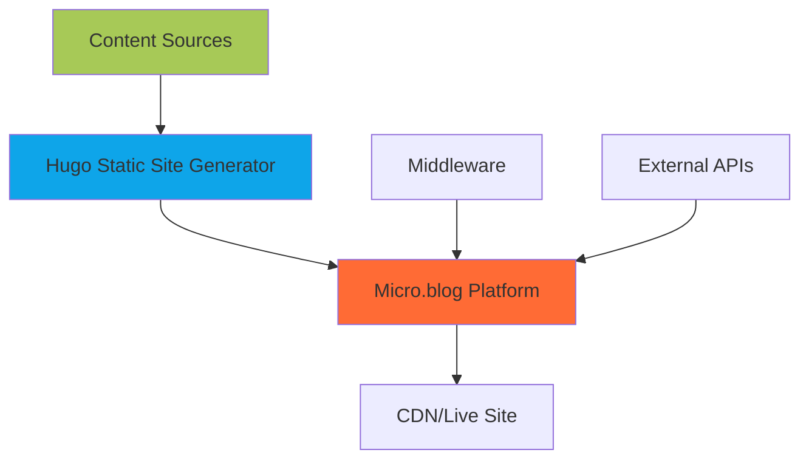

**Core Technologies:**
- **Generator:** Hugo Extended (v0.91+)
- **Platform:** Micro.blog (hosting & content management)
- **Fonts:** Fraunces (headings), Inter (body) via Google Fonts
- **Analytics:** Umami (privacy-focused)
- **Styling:** Vanilla CSS with CSS Custom Properties
- **JavaScript:** Vanilla JS (no frameworks)

---

## Architecture

### High-Level System Architecture

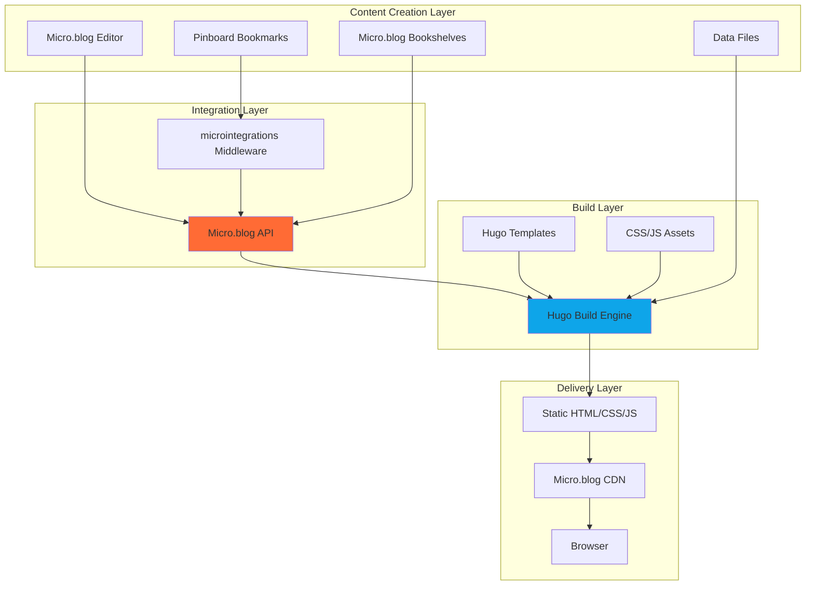

### Directory Structure

```
mbtheme/
├── config.json              # Theme default configuration
├── plugin.json              # Micro.blog plugin metadata (VERSION CRITICAL)
├── theme.toml               # Hugo theme metadata
├── dev.sh                   # Local development server script
│
├── layouts/                 # Template files (Hugo Go templates)
│   ├── _default/
│   │   ├── baseof.html     # Base HTML wrapper (all pages)
│   │   ├── single.html     # Single post/page view + search
│   │   ├── list.html       # Archive/section lists
│   │   ├── taxonomy.html   # Category/tag detail pages
│   │   └── terms.html      # Category/tag index pages
│   │
│   ├── index.html          # Homepage timeline
│   ├── 404.html            # Error page
│   │
│   ├── partials/           # Reusable components
│   │   ├── head.html       # <head> section (meta, fonts, CSS)
│   │   ├── site-header.html    # Header with nav & theme toggle
│   │   ├── site-footer.html    # Footer with newsletter
│   │   ├── post-summary.html   # Post card component
│   │   ├── category-badge.html # Category badges with emoji
│   │   ├── newsletter.html     # Newsletter signup form
│   │   ├── search.html         # Search icon link
│   │   └── watching-grid.html  # Movie/TV grid layout
│   │
│   ├── post/single.html        # Blog post layout
│   ├── reading/single.html     # Bookshelf page
│   ├── watching/              # Movie/TV tracking pages
│   ├── links/single.html       # Links/bookmarks page
│   ├── location/single.html    # Location pages (e.g., /seattle)
│   ├── colophon/single.html    # About the site/tech stack
│   ├── styleguide/single.html  # Design system documentation
│   │
│   └── shortcodes/
│       └── tweetarchive.html   # Twitter archive shortcode
│
├── static/                 # Static assets
│   ├── css/
│   │   └── main.css        # Primary stylesheet (1015 lines)
│   └── js/
│       └── saunter.js      # Theme JS (nav, dark mode, newsletter)
│
├── docs/                   # User documentation
│   ├── configuration.md
│   ├── customization.md
│   └── development.md
│
└── README.md               # Main documentation
```

### Template Hierarchy

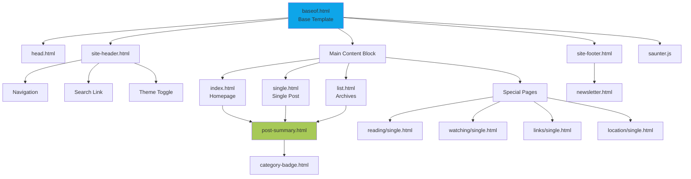

---

## Middleware Integration

### Overview

The Saunter theme integrates with an external middleware system called **microintegrations** that syncs data from external services into Micro.blog.

### 🎯 Key Architectural Principle: Micro.blog as Source of Truth

**All production data lives in Micro.blog's database.** The theme never directly queries external APIs or relies on local data files in production.

**How Enrichment Works:**

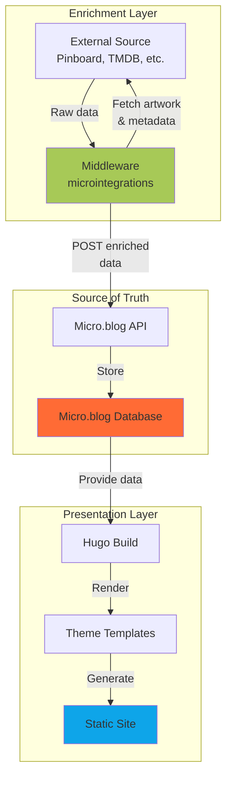

**Key Points:**
1. **Middleware enriches BEFORE posting** - Fetches artwork, metadata, etc.
2. **Micro.blog stores enriched data** - Database contains complete information
3. **Theme reads from Micro.blog only** - No external API calls at build time
4. **Data files are for local dev only** - Not used in production

**Enrichment Workflows:**

**Workflow A: Pre-Enrichment (Pinboard Links)**
1. User bookmarks in Pinboard
2. Middleware fetches from Pinboard RSS
3. Middleware enriches with OG images/metadata
4. Middleware posts to Micro.blog
5. Theme displays enriched content

**Workflow B: Post-Facto Enrichment (Books/Movies)**
1. User posts "Watched: Movie Title" directly in Micro.blog (no poster)
2. Middleware periodically polls Micro.blog for unenriched posts
3. Middleware detects missing artwork (`image` field empty)
4. Middleware fetches poster from TMDB API
5. Middleware updates Micro.blog post with `image` field
6. Theme displays enriched content on next build

Both workflows result in Micro.blog as the source of truth with enriched data.

### Architecture

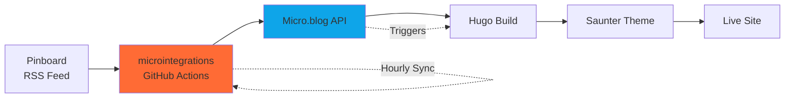

### Middleware Configuration

**Repository:** `https://github.com/rocksoup/microintegrations`

**Main Script:** `scripts/microblog-sync.mjs`

**Environment Variables:**
```bash
PINBOARD_MICROBLOG_FEED_URL  # URL to Pinboard RSS feed
MICROBLOG_TOKEN              # Authentication token for Micro.blog API
DRY_RUN                      # Testing flag (preview without posting)
```

**Automation:**
- GitHub Actions runs hourly
- Fetches new bookmarks from Pinboard RSS
- Transforms into Micro.blog post format
- Posts to Micro.blog API with metadata

### Data Flow: Pinboard to Live Site

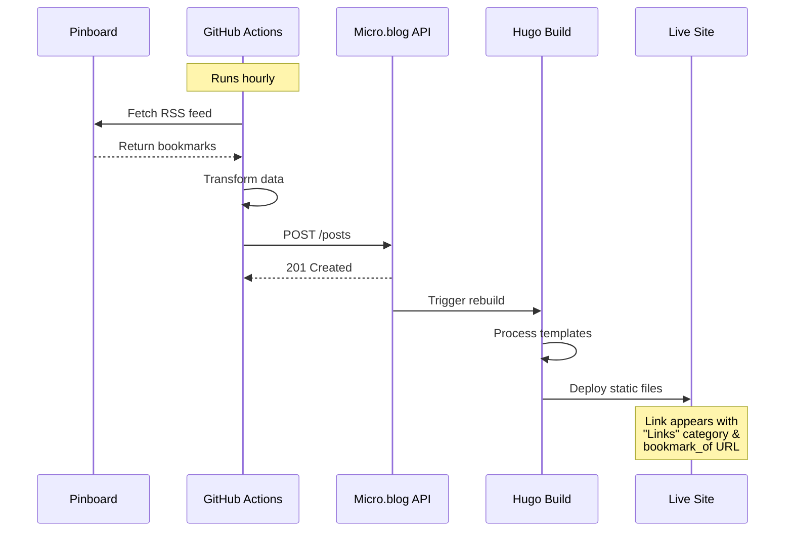

### How Theme Handles Middleware Data

The theme recognizes middleware-synced posts through specific frontmatter parameters:

**Post Structure from Middleware:**
```yaml
---
title: "Interesting Article Title"
date: 2025-11-21T10:00:00-07:00
categories:
  - Links                                    # Required for filtering
bookmark_of: "https://example.com/article"  # Source URL
image: "https://example.com/og-image.jpg"   # Optional OG image
---

Your commentary or notes about the link...
```

**Template Detection:**

In `layouts/partials/post-summary.html`:
```go
{{ with .Params.bookmark_of }}
<a class="bookmark-link" href="{{ . }}" rel="noopener" target="_blank">
  Source ↗
</a>
{{ end }}
```

In `layouts/_default/single.html`:
```go
{{ with .Params.bookmark_of }}
  (via <a href="{{ . }}">{{ (urls.Parse .).Host }}</a>)
{{ end }}
```

**Links Page Filtering:**

In `layouts/links/single.html`:
```go
{{ range $page := .Site.RegularPages }}
  {{ range $page.Params.categories }}
    {{ if or (eq (lower .) "links") (eq . "Links") }}
      {{/* Display this post */}}
    {{ end }}
  {{ end }}
{{ end }}
```

---

## Micro.blog Platform Integration

### Overview

Micro.blog serves as both the **content management system** and **hosting platform**. The theme is deeply integrated with Micro.blog's features and APIs.

### Micro.blog Hosting Model

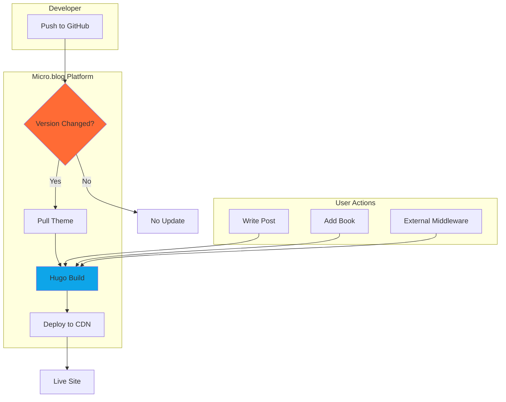

**Key Points:**
- Micro.blog monitors `plugin.json` version field
- Version increment triggers automatic theme update
- Hugo compilation happens on Micro.blog servers
- Immediate deployment to CDN upon build completion

### Version Management (CRITICAL)

**Two locations must be updated for theme updates:**

1. **`plugin.json`:**
```json
{
  "version": "0.1.24"
}
```

2. **`layouts/partials/head.html`:**
```html
<meta name="generator" content="Saunter 0.1.24">
```

**Why This Matters:**
- Micro.blog ONLY detects updates via `plugin.json` version
- Without version increment, changes won't deploy
- Both should stay in sync for consistency

### Micro.blog-Specific Features

#### 1. Microblog-Style Posts

**Short posts without titles (Twitter-like):**

```yaml
---
date: 2025-11-21T10:00:00-07:00
microblog: true  # Optional - auto-detected if no title
---

Your short post content here...
```

**Template Detection:**
```go
{{- $showTitle := and $title (not .Params.microblog) -}}
{{ if $showTitle }}
  <h2>{{ $title }}</h2>
{{ end }}
```

#### 2. Bookshelves Integration

**Data Flow:**

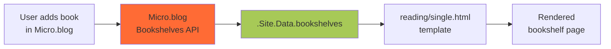

**Data Structure:**
```json
{
  "currentlyReading": [
    {
      "title": "Book Title",
      "author": "Author Name",
      "isbn": "9781234567890",
      "cover_url": "https://covers.openlibrary.org/..."
    }
  ],
  "wantToRead": [...],
  "wanttoread": [...],     // alias for theme fallbacks
  "want-to-read": [...],   // alias for theme fallbacks
  "finished": [...]
}
```

**Template Access (with fallbacks):**
```go
{{/* Tries multiple key variations for API compatibility */}}
{{ with .Site.Data.bookshelves.currentlyreading }}
  {{ $currentlyReading = . }}
{{ end }}

{{ with .Site.Data.bookshelves.wanttoread }}
  {{ $wantToRead = . }}
{{ else with .Site.Data.bookshelves.want }}
  {{ $wantToRead = . }}
{{ else with index .Site.Data.bookshelves "want-to-read" }}
  {{ $wantToRead = . }}
{{ end }}
```

**Cover Image Optimization (0.1.66):**
```go
{{ $coverUrl := .cover_url | default .image }}
{{ if $coverUrl }}
  {{ $clean := $coverUrl | replaceRE `zoom=[0-9]+` "zoom=0" | replaceRE `zoom%3D[0-9]+` "zoom%3D0" | replaceRE `/photos/[0-9]+x/` "/photos/2000x/" }}
  {{ $openLibrary := "" }}
  {{ with .isbn }}{{ $openLibrary = printf "https://covers.openlibrary.org/b/isbn/%s-L.jpg" . }}{{ end }}
  {{ $final := cond (ne $clean "") $clean (cond (ne $openLibrary "") $openLibrary $coverUrl) }}
  
{{ end }}
```
- `.image` is used as a fallback when `cover_url` is missing.
- Preference order: 1) Google Books zoom=0 (2000px CDN), 2) Open Library by ISBN, 3) original provided URL as last resort.
- Forces Google Books zoom to 0 (even when URL-encoded) and swaps Micro.blog CDN size to 2000px.
- If all sources fail, the template renders a “Cover unavailable” placeholder and emits hidden debug spans (`data-missing-cover="true"`) with title/ISBN for troubleshooting.
- For heavier optimization/caching, push this logic upstream (e.g., microintegrations) to store normalized URLs or downloaded images once, rather than per-render.

#### 3. Twitter Archive Integration

**Shortcode:** ``

**How it works:**
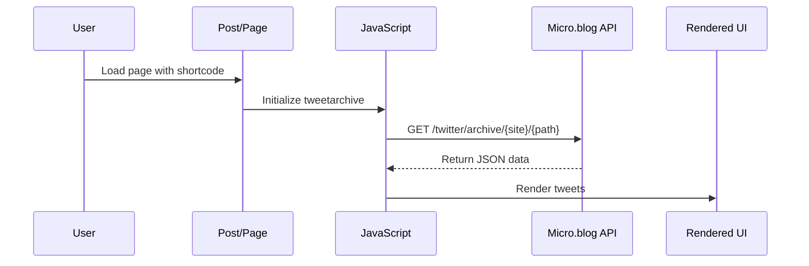

**API Endpoints:**
- `https://micro.blog/twitter/archive/{site_id}/recent.json` - Recent tweets
- `https://micro.blog/twitter/archive/{site_id}/years.json` - Available years
- `https://micro.blog/twitter/archive/{site_id}/{year}/{month}.json` - Month archive
- `https://micro.blog/twitter/archive/{site_id}/search.json?q=keyword` - Search

#### 4. Search Integration

**Micro.blog Search Plugin provides:**
- JSON feed at `/archive/index.json`
- Client-side search via JavaScript
- No external search service needed

**Data Structure:**
```json
{
  "version": "https://jsonfeed.org/version/1",
  "items": [
    {
      "id": "https://example.com/2024/11/post-title",
      "title": "Post Title",
      "content_text": "Post content...",
      "date_published": "2024-11-21T10:00:00-07:00"
    }
  ]
}
```

#### 5. Newsletter Integration

**🎯 Architectural Decision: Mailchimp Instead of Micro.blog Native**

This site **intentionally uses Mailchimp** rather than Micro.blog's built-in newsletter feature. This is a deliberate deviation from Micro.blog conventions.

**Current Configuration (Mailchimp):**
```json
{
  "newsletter": {
    "enabled": true,
    "action": "https://stoneberg.us6.list-manage.com/subscribe/post?u=...",
    "method": "post",
    "placeholder": "Email address",
    "button": "Subscribe"
  },
  "mailchimp_honeypot": "b_abc123_def456"
}
```

**Rationale:**
- Greater control over email design and delivery
- Advanced segmentation and analytics
- Established subscriber base in Mailchimp
- Custom automation workflows

**Theme Implementation:**
- Theme checks for `newsletter.action` parameter
- **If action URL provided** → Renders Mailchimp form with honeypot protection
- **If action is empty** → Falls back to Micro.blog native button

**To disable Micro.blog native newsletter at platform level:**
1. Go to Micro.blog Dashboard → Settings → Newsletter
2. Disable newsletter feature
3. This prevents Micro.blog from sending notifications while Mailchimp remains active

**Alternative: Micro.blog Native (not currently used):**
```html
<form action="https://micro.blog/users/follow" method="post">
  <input type="email" name="email" required>
  <button type="submit">Subscribe</button>
</form>
```

### Publishing Workflow

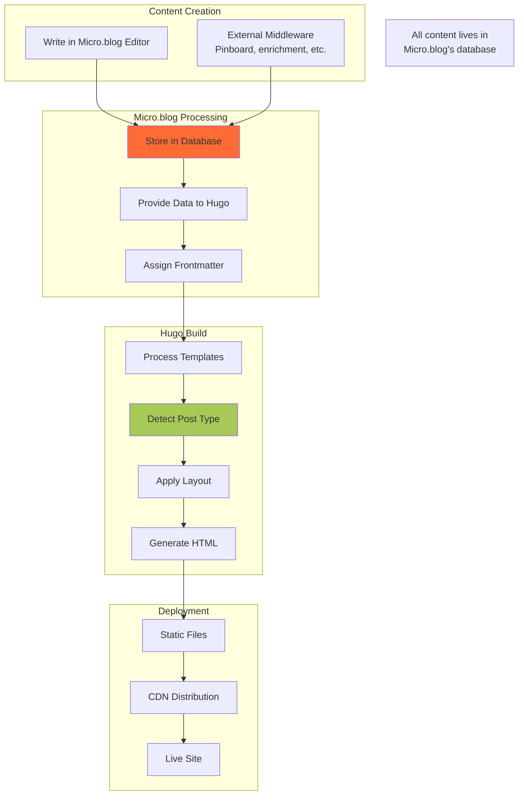

---

## Content Authoring

### Content Type Overview

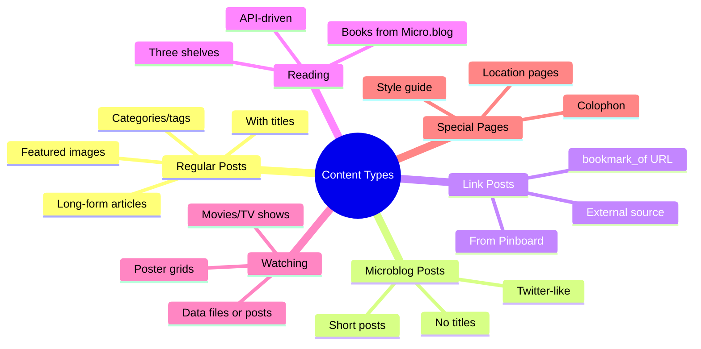

### 1. Regular Blog Posts

**Creation Method:** Write in Micro.blog editor or create Markdown file

**Frontmatter:**
```yaml
---
title: "My Post Title"
date: 2025-11-21T10:00:00-07:00
categories:
  - journal
  - design
featured_image: "https://example.com/image.jpg"
---

Your post content here with **markdown** formatting.
```

**Authoring Workflow:**

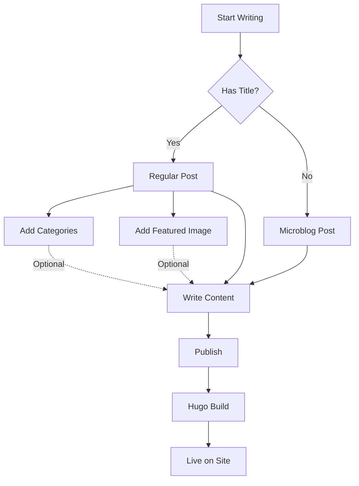

**Available Parameters:**
- `title` - Post title (omit for microblog posts)
- `date` - Publication date (ISO 8601 format)
- `categories` - Array of categories
- `tags` - Array of tags
- `featured_image` / `image` / `images[]` - Featured image
- `hide_featured_image` - Prevent automatic image display
- `description` - Meta description for SEO
- `microblog` - Force microblog rendering

### 2. Microblog Posts

**What Makes Them Different:**
- No title or empty title
- Content displays directly (no heading)
- Twitter/Mastodon-like short posts

**Creation:**
```yaml
---
date: 2025-11-21T10:00:00-07:00
categories:
  - journal
---

Just saw the most amazing sunset. The sky was painted in shades of orange and pink.
```

**Template Behavior:**
```go
{{- $title := .Title -}}
{{- if not $title }}
  {{- $title = (.Summary | plainify | truncate 80) -}}
{{- end -}}
{{- $showTitle := and $title (not .Params.microblog) -}}

{{ if $showTitle }}
  <h2><a href="{{ .RelPermalink }}">{{ $title }}</a></h2>
{{ end }}
```

### 3. Link/Bookmark Posts

**Source:** Pinboard via microintegrations middleware

**Structure:**
```yaml
---
title: "Interesting Article Title"
date: 2025-11-21T10:00:00-07:00
categories:
  - Links  # Required
bookmark_of: "https://source-url.com"
image: "https://example.com/og-image.jpg"  # Optional
---

Your commentary about the link...
```

**Workflow:**

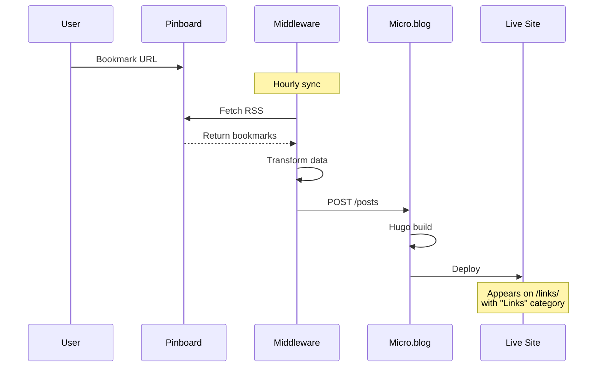

**Display Features:**
- Shows "Source ↗" link to original URL
- Displays domain in title: `(via example.com)`
- Appears on dedicated `/links/` page
- Can include OG image from bookmarked page

### 4. Reading/Bookshelf Content

**🎯 Source of Truth: Micro.blog Bookshelves API**

In production, book data comes from Micro.blog's native Bookshelves feature.

**Authoring & Enrichment Workflow:**
1. **You add book** in Micro.blog Bookshelves (by ISBN or title)
2. **Micro.blog enriches** automatically by fetching cover from Open Library
3. **API provides** enriched data via `.Site.Data.bookshelves`
4. **Theme reads** and displays with covers
5. **(Optional) Middleware can monitor** for missing covers and backfill from alternative sources

Note: Micro.blog handles book enrichment natively, so middleware is typically not needed for books unless cover art is unavailable from Open Library.

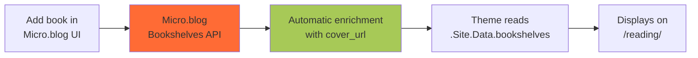

**Local Development Only: Data Files**

For local testing without Micro.blog connection, create `data/bookshelves.json`:
```json
{
  "currentlyreading": [
    {
      "title": "The Midnight Library",
      "author": "Matt Haig",
      "isbn": "9780525559474",
      "cover_url": "https://covers.openlibrary.org/b/isbn/9780525559474-L.jpg"
    }
  ],
  "wanttoread": [],
  "finishedreading": []
}
```

**Page Setup:**
```yaml
---
title: "Reading"
type: "reading"
url: "/reading/"
---

Books I'm reading, want to read, and have finished.
```

**Template Features:**
- Three sections with headings
- Responsive grid layout
- Books link to `https://micro.blog/books/{isbn}`
- Cover images optimized (600x resolution)
- Graceful fallback for missing covers

### 5. Watching Content

**🎯 Source of Truth: Micro.blog Posts**

In production, movie/TV data comes from posts with "Watched:" prefix stored in Micro.blog's database.

**Authoring & Enrichment Workflow:**
1. **You author** in Micro.blog: Create post "Watched: Movie Title" (artwork optional)
2. **Middleware monitors** Micro.blog for posts without `image` field
3. **Middleware enriches** by fetching poster from TMDB/IMDB API
4. **Middleware updates** the post in Micro.blog with `image` frontmatter
5. **Hugo rebuilds** with enriched data
6. **Theme displays** poster from Micro.blog post

This means you can post immediately without artwork, and the middleware will enrich it later.

**🔍 Critical Implementation Detail: Handling Titleless Posts**

The watching grid implementation handles a common Micro.blog pattern: **titleless microblog-style posts** where the "Watched:" prefix appears only in the content, not the title field.

**Detection Strategy:**
```go
{{ $pages := .Site.Pages }}
{{ range $pages }}
  {{ if eq .Kind "page" }}
    {{ $title := .Title | default "" | trim " \t\r\n" }}
    {{ $summary := .Summary | default "" }}
    {{ $content := .Content | plainify | default "" }}
    {{ $contentFirstLine := index (split $content "\n") 0 | default "" | trim " \t\r\n" }}

    {{/* Check if title, summary, or first line of content contains "Watched:" */}}
    {{ $matched := false }}
    {{ if hasPrefix $title "Watched:" }}
      {{ $matched = true }}
    {{ else if hasPrefix $summary "Watched:" }}
      {{ $matched = true }}
    {{ else if hasPrefix $contentFirstLine "Watched:" }}
      {{ $matched = true }}
    {{ end }}

    {{ if $matched }}
      {{ $posts = $posts | append . }}
    {{ end }}
  {{ end }}
{{ end }}
```

**Title Extraction for Titleless Posts:**
```go
{{ $rawTitle := .Title | default "" | trim " \t\r\n" }}
{{ if not $rawTitle }}
  {{/* No title, extract from summary */}}
  {{ $summary := .Summary | default "" }}
  {{ $plainSummary := $summary | plainify }}
  {{ $firstLine := index (split $plainSummary "\n") 0 | default "" | trim " \t\r\n" }}
  {{ $rawTitle = $firstLine }}
{{ end }}
{{ $title := $rawTitle | replaceRE "^Watched:\\s*" "" | replaceRE "🍿.*$" "" | trim " \t\r\n" }}
```

**Key Learnings:**
1. **Use `.Site.Pages` not `.Site.RegularPages`** - RegularPages may miss certain post types
2. **Filter by `.Kind == "page"`** - Ensures you get actual content pages, not sections or home
3. **Check multiple sources** - Title, Summary, and Content first line
4. **Use `.Summary | plainify`** - More reliable than `.Content | plainify` for extraction
5. **The timing of plainify matters** - Get Summary first, then plainify it

See [Working with Titleless Posts](#working-with-titleless-posts) for more details on this pattern.

**Production: Posts with "Watched:" Prefix**

```yaml
---
title: "Watched: The Shawshank Redemption"
date: 2025-11-21T10:00:00-07:00
image: "https://example.com/poster.jpg"  # Enriched by middleware
---

Incredible story about hope and friendship. Morgan Freeman's narration is perfect.
```

**Legacy Local Data (removed)**

Earlier iterations generated `data/watched.enriched.json` for local Hugo testing. That JSON workflow has been removed; production uses Micropub UPDATE with inline images as the source of truth.

**Production Workflow - Post-Facto Enrichment:**

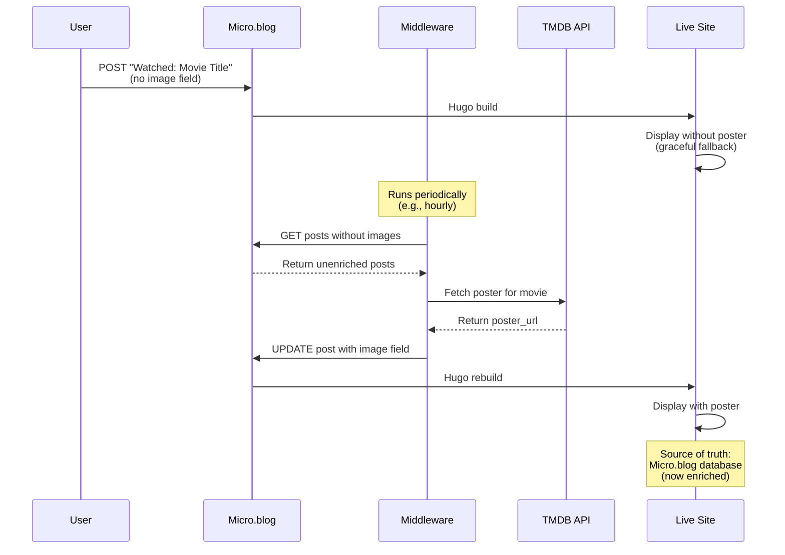

**Local Development Workflow:**

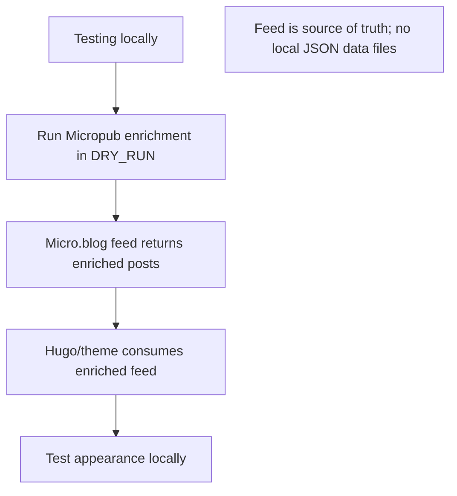

**Page Setup:**
```yaml
---
title: "Watching"
type: "watching"
url: "/watching/"
---

Movies and TV shows I've watched.
```

### 6. Special Content Types

#### Colophon Page

**Purpose:** Technical documentation about how the site is built

```yaml
---
title: "Colophon"
type: "colophon"
url: "/colophon/"
menu: "main"
weight: 100
---
```

**Features:**
- Hardcoded content in template
- No body content needed
- Documents platform, theme, middleware, credits

#### Location Page

**Purpose:** Custom pages for cities/locations with live imagery

```yaml
---
title: "Seattle"
type: "location"
hero_image: "https://example.com/seattle-cam.jpg"
hero_caption: "Seattle waterfront - live view"
---

I live in Seattle, a beautiful city in the Pacific Northwest...
```

**Features:**
- Hero image with caption
- Can use live webcam URLs
- JavaScript refreshes images with cache-busting

#### Style Guide Page

**Purpose:** Visual reference for all theme components

```yaml
---
title: "Style Guide"
type: "styleguide"
url: "/styleguide/"
---
```

**Features:**
- Documents design system
- Shows typography, colors, spacing
- Live component examples
- Useful for theme development

---

## Working with Titleless Posts

### Overview

One of the unique characteristics of Micro.blog is support for **titleless posts** (microblog-style content). These posts have an empty `.Title` field, with content starting immediately in the body. This pattern is common for:

- Short status updates
- Quick thoughts
- Media posts with custom prefixes (e.g., "Watched: Movie Title", "Reading: Book Title")
- Twitter-like microposts

### The Challenge

When building features that rely on detecting posts by title prefix (e.g., filtering all "Watched:" posts for a watching page), titleless posts present a unique challenge:

**Problem:**
- Post has no `.Title` value (empty string or null)
- The identifying prefix ("Watched:") appears only in the `.Content` or `.Summary`
- Standard title-based filtering misses these posts

**Example Post Structure:**
```yaml
---
date: 2025-11-14T08:17:48-08:00
# Note: no title field
---

Watched: Her 🍿

Surprised how affecting this film is. Joaquin Phoenix's performance is incredible.
```

### The Solution: Multi-Source Content Detection

The key is to check **multiple sources** in order of reliability:

```go
{{ $pages := .Site.Pages }}
{{ range $pages }}
  {{ if eq .Kind "page" }}
    {{/* 1. Try title first */}}
    {{ $title := .Title | default "" | trim " \t\r\n" }}

    {{/* 2. Get summary (Hugo's extracted excerpt) */}}
    {{ $summary := .Summary | default "" }}

    {{/* 3. Get full content as fallback */}}
    {{ $content := .Content | plainify | default "" }}
    {{ $contentFirstLine := index (split $content "\n") 0 | default "" | trim " \t\r\n" }}

    {{/* Check all three sources */}}
    {{ $matched := false }}
    {{ if hasPrefix $title "Watched:" }}
      {{ $matched = true }}
    {{ else if hasPrefix $summary "Watched:" }}
      {{ $matched = true }}
    {{ else if hasPrefix $contentFirstLine "Watched:" }}
      {{ $matched = true }}
    {{ end }}

    {{ if $matched }}
      {{ $posts = $posts | append . }}
    {{ end }}
  {{ end }}
{{ end }}
```

### Best Practices

#### 1. Use `.Site.Pages` Not `.Site.RegularPages`

**Wrong:**
```go
{{ $pages := .Site.RegularPages }}  {{/* May miss certain post types */}}
```

**Right:**
```go
{{ $pages := .Site.Pages }}  {{/* Gets all pages */}}
{{ range $pages }}
  {{ if eq .Kind "page" }}  {{/* Filter to content pages */}}
    {{/* Your logic here */}}
  {{ end }}
{{ end }}
```

**Why:** `.Site.RegularPages` applies Hugo's built-in filtering which may exclude posts based on type or section. `.Site.Pages` gives you complete control.

#### 2. Extract Titles from `.Summary` Not `.Content`

**Less Reliable:**
```go
{{ $content := .Content | plainify }}
{{ $firstLine := index (split $content "\n") 0 }}
```

**More Reliable:**
```go
{{ $summary := .Summary | default "" }}
{{ $plainSummary := $summary | plainify }}
{{ $firstLine := index (split $plainSummary "\n") 0 }}
```

**Why:** `.Summary` is Hugo's intelligently extracted excerpt (first 70 words or until `<!--more-->`). It's already processed and more consistent than raw `.Content`. For titleless posts, `.Summary` typically contains the first sentence, which is exactly what you need.

#### 3. The Order of Plainify Matters

**Wrong (subtle bug):**
```go
{{ $summary := .Summary | plainify | default "" }}
{{/* If Summary is null, plainify runs on null, default never triggers */}}
```

**Right:**
```go
{{ $summary := .Summary | default "" }}
{{ $plainSummary := $summary | plainify }}
{{/* Default provides empty string first, THEN plainify runs */}}
```

**Why:** Hugo template piping is left-to-right. If `.Summary` is null and you pipe directly to `plainify`, the default may not catch it properly. Always apply `default` first to ensure you have a string to work with.

#### 4. Handle `.Plain` vs `.Summary` vs `.Content`

**Understanding the Differences:**

| Property | What It Is | When to Use |
|----------|-----------|-------------|
| `.Title` | Post title field | Always check first - fastest |
| `.Summary` | First ~70 words OR content before `<!--more-->` | Best for extracting first line of titleless posts |
| `.Content` | Full rendered HTML content | Use when you need complete post text |
| `.Plain` | Full content as plain text | Use when you need all text without HTML |

**Example - Extracting Movie Title:**
```go
{{/* Step 1: Check if there's an explicit title */}}
{{ $rawTitle := .Title | default "" | trim " \t\r\n" }}

{{/* Step 2: For titleless posts, extract from summary */}}
{{ if not $rawTitle }}
  {{ $summary := .Summary | default "" }}
  {{ $plainSummary := $summary | plainify }}
  {{ $firstLine := index (split $plainSummary "\n") 0 | default "" | trim " \t\r\n" }}
  {{ $rawTitle = $firstLine }}
{{ end }}

{{/* Step 3: Clean up the extracted title */}}
{{ $title := $rawTitle | replaceRE "^Watched:\\s*" "" }}  {{/* Remove prefix */}}
{{ $title = $title | replaceRE "🍿.*$" "" }}              {{/* Remove emoji and trailing content */}}
{{ $title = $title | trim " \t\r\n" }}                    {{/* Final trim */}}
```

### Common Patterns for Other Content Types

This pattern can be applied to any prefix-based content detection:

#### Reading List ("Reading: Book Title")
```go
{{ range .Site.Pages }}
  {{ if eq .Kind "page" }}
    {{ $title := .Title | default "" }}
    {{ $summary := .Summary | default "" | plainify }}
    {{ if or (hasPrefix $title "Reading:") (hasPrefix $summary "Reading:") }}
      {{/* This is a reading post */}}
    {{ end }}
  {{ end }}
{{ end }}
```

#### Status Updates ("Status: Current Activity")
```go
{{ range .Site.Pages }}
  {{ if eq .Kind "page" }}
    {{ $title := .Title | default "" }}
    {{ $summary := .Summary | default "" | plainify }}
    {{ if or (hasPrefix $title "Status:") (hasPrefix $summary "Status:") }}
      {{/* This is a status update */}}
    {{ end }}
  {{ end }}
{{ end }}
```

#### Photo Posts ("Photo:" or hashtag-based)
```go
{{ range .Site.Pages }}
  {{ if eq .Kind "page" }}
    {{ $title := .Title | default "" }}
    {{ $content := .Content | plainify }}
    {{ if or (hasPrefix $title "Photo:") (in $content "#photos") }}
      {{/* This is a photo post */}}
    {{ end }}
  {{ end }}
{{ end }}
```

### Debugging Titleless Post Detection

If your filter isn't finding posts, add debug output:

```go
<div style="padding:1rem;background:#f0f0f0;margin:1rem 0;">
  <strong>Debug Info:</strong><br>
  Total .Site.Pages: {{ len .Site.Pages }}<br>
  Total .Site.RegularPages: {{ len .Site.RegularPages }}<br>
  Matched posts: {{ len $posts }}<br>

  <details>
    <summary>First 10 pages (click to expand)</summary>
    {{ range first 10 .Site.Pages }}
      {{ if eq .Kind "page" }}
        <div style="margin:0.5rem 0;padding:0.5rem;background:white;border-left:3px solid #ddd;">
          <strong>Kind:</strong> {{ .Kind }}<br>
          <strong>Type:</strong> {{ .Type }}<br>
          <strong>Title:</strong> "{{ .Title }}"<br>
          <strong>Summary (first 80 chars):</strong> "{{ .Summary | plainify | truncate 80 }}"<br>
          <strong>URL:</strong> {{ .RelPermalink }}
        </div>
      {{ end }}
    {{ end }}
  </details>
</div>
```

**What to Look For:**
1. Is the post showing up in the list?
2. Is `.Title` empty as expected?
3. Does `.Summary` contain your prefix?
4. Is `.Kind` equal to "page"?

### Performance Considerations

**Iterating Over All Pages:**
- `.Site.Pages` can be large (hundreds or thousands of posts)
- Hugo's template engine is fast, but be mindful
- Consider caching the filtered list if used in multiple places

**Caching Filtered Results:**
```go
{{/* Calculate once */}}
{{ $watchedPosts := slice }}
{{ range .Site.Pages }}
  {{ if eq .Kind "page" }}
    {{ $summary := .Summary | default "" | plainify }}
    {{ if hasPrefix $summary "Watched:" }}
      {{ $watchedPosts = $watchedPosts | append . }}
    {{ end }}
  {{ end }}
{{ end }}

{{/* Store in scratch for reuse */}}
{{ $.Scratch.Set "watchedPosts" $watchedPosts }}

{{/* Use anywhere in template */}}
{{ range $.Scratch.Get "watchedPosts" }}
  {{/* Render post */}}
{{ end }}
```

### Real-World Example: The Watching Grid Bug

**The Original Problem (v0.1.37):**
- The `/watching/` page showed "No watching data found"
- Five "Watched:" posts existed in the archive
- Posts had empty `.Title` fields - content started with "Watched: Movie Title"
- Template only checked `.Title`, missed all titleless posts

**The Solution Journey:**

1. **v0.1.38-39:** Tried `.Site.RegularPages` - matched 0 posts
2. **v0.1.40:** Switched to `.Site.Pages` with `.Kind == "page"` - matched 5 posts! But titles were blank
3. **v0.1.41:** Tried extracting from `.Content | plainify` - still blank
4. **v0.1.42-43:** Switched to `.Summary | plainify` - **SUCCESS!** Titles extracted correctly

**Final Working Implementation:**
- Uses `.Site.Pages` filtered by `.Kind == "page"`
- Checks `.Title`, `.Summary`, and `.Content` first line
- Extracts title from `.Summary | plainify` for titleless posts
- Cleans extracted title with `replaceRE` to remove prefix and emoji

**Files modified:** `layouts/partials/watching-grid.html` (lines 10-93)

### Summary

**Key Takeaways:**
1. Titleless posts are a Micro.blog feature, not a bug
2. Always check multiple content sources (Title → Summary → Content)
3. Use `.Site.Pages` with `.Kind == "page"` for complete control
4. Extract from `.Summary | plainify` for best results
5. Apply `default ""` BEFORE `plainify`, not after
6. Test with debug output when building new filters
7. This pattern works for any prefix-based content detection

**This pattern enables:**
- Watching pages (Watched: Movie)
- Reading logs (Reading: Book)
- Status updates (Status: Activity)
- Check-ins (@ Location)
- Any custom microblog convention

---

## Content Display & Rendering

### Homepage Timeline

**Template:** `layouts/index.html`

**Flow:**

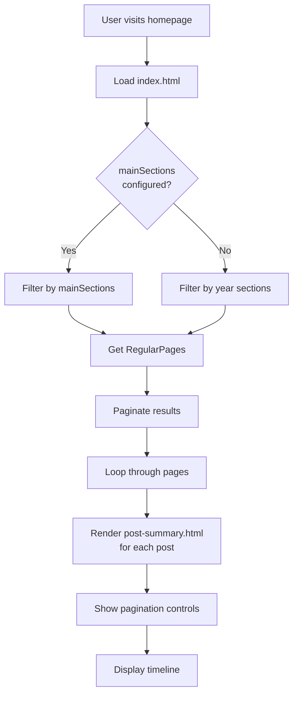

**Template Logic:**
```go
{{ $sections := .Site.Params.mainSections }}
{{ if not $sections }}
  {{ $sections = slice }}
{{ end }}

{{ $pages := .Site.RegularPages }}
{{ if gt (len $sections) 0 }}
  {{ $pages = where $pages "Type" "in" $sections }}
{{ else }}
  {{ $pages = where $pages "Section" "matches" "^[0-9]{4}$" }}
{{ end }}

{{ $paginator := .Paginate $pages }}
{{ range $paginator.Pages }}
  {{ partial "post-summary.html" . }}
{{ end }}
```

**Post Summary Component:**

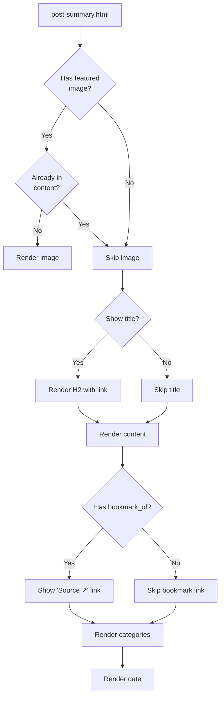

### Single Post Rendering

**Template Hierarchy:**

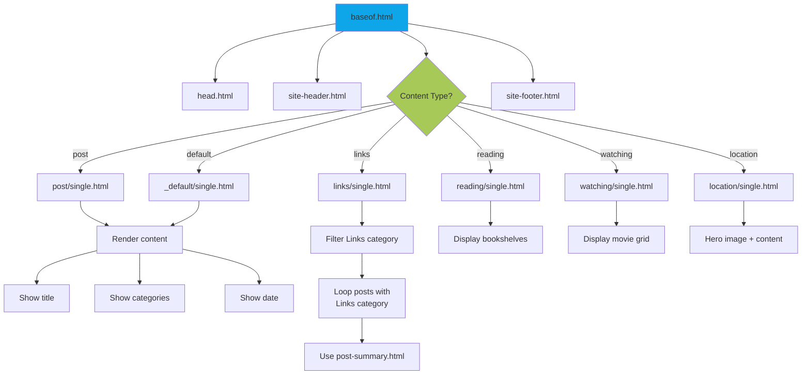

**Featured Image Logic:**
```go
{{/* Check multiple possible image parameters */}}
{{ $image := "" }}
{{ with .Params.featured_image }}
  {{ $image = . }}
{{ else with .Params.image }}
  {{ $image = . }}
{{ else }}
  {{ with .Params.images }}
    {{ $image = index . 0 }}
  {{ end }}
{{ end }}

{{/* Only show if not hidden and not already in content */}}
{{ if and $image (not .Params.hide_featured_image) }}
  {{ if not (in .RawContent $image) }}
    
  {{ end }}
{{ end }}
```

### Archive & List Pages

**Template:** `layouts/_default/list.html`

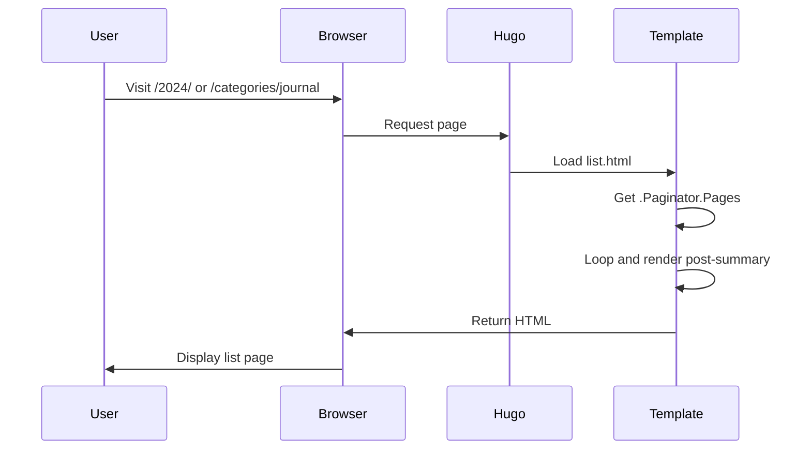

**Features:**
- Shows page title and description
- Paginates posts (same as homepage)
- Uses post-summary partial for consistency
- Pagination controls at bottom

### Navigation System

**Template:** `layouts/partials/site-header.html`

**Components:**

```mermaid
graph LR
    A[Site Header] --> B[Brand/Logo]
    A --> C[Primary Nav]
    A --> D[Nav Tools]

    C --> C1[Menu Items]
    C --> C2{Desktop}
    C --> C3{Mobile}

    C2 -->|Show| E[Horizontal List]
    C3 -->|Show| F[Hamburger Menu]

    D --> D1[Search Icon]
    D --> D2[Theme Toggle]

    style A fill:#0EA5E9
```

**Menu Configuration:**

From `config.json`:
```json
{
  "menu": {
    "main": [
      {"name": "All", "url": "/"},
      {"name": "Journal", "url": "/categories/journal"},
      {"name": "Links", "url": "/links/"},
      {"name": "Books", "url": "/reading/"},
      {"name": "Watching", "url": "/watching/"}
    ]
  }
}
```

**Active State Detection:**
```go
{{ $isActive := false }}
{{ if eq $url "/" }}
  {{ $isActive = eq $.RelPermalink $url }}
{{ else if hasPrefix $.RelPermalink $url }}
  {{ $isActive = true }}
{{ end }}

<a {{ if $isActive }}class="active"{{ end }}>
```

**Mobile Menu Flow:**

```mermaid
sequenceDiagram
    participant User
    participant Button as Hamburger Button
    participant Nav as Navigation
    participant JS as JavaScript

    User->>Button: Click hamburger
    Button->>JS: Fire click event
    JS->>Nav: Toggle .show class
    JS->>Button: Update aria-expanded
    Nav->>User: Display menu overlay

    User->>Nav: Click link
    JS->>Nav: Auto-close menu

    Note over User,JS: Also closes on:<br/>- Click outside<br/>- ESC key
```

### Search Functionality

**How It Works:**

```mermaid
flowchart TD
    A[User visits /search/] --> B[Page loads]
    B --> C[JavaScript fetches<br/>/archive/index.json]
    C --> D[Store data in memory]
    D --> E[User types query]
    E --> F[Split into keywords]
    F --> G[Filter posts]
    G --> H{All keywords<br/>match?}
    H -->|Yes| I[Include in results]
    H -->|No| J[Exclude from results]
    I --> K[Render result card]
    K --> L[Display results]

    style C fill:#A7C957
    style G fill:#0EA5E9
```

**Search Algorithm:**
```javascript
const keywords = query.toLowerCase().split(/\s+/);
const matches = archive.items.filter(item => {
  const content = (
    (item.title || "") + " " +
    (item.content_text || "")
  ).toLowerCase();

  // All keywords must match (AND logic)
  return keywords.every(kw => content.includes(kw));
});
```

**Features:**
- Client-side (no server needed)
- Real-time as you type
- URL parameter sync (`?q=keyword`)
- Searches titles and content
- All keywords must match (AND)
- Case-insensitive

### Category System

**Badge Component:** `layouts/partials/category-badge.html`

**Emoji Mapping:**

```mermaid
graph LR
    A[Category Name] --> B{Match Category}
    B -->|journal| C["🗒️ journal"]
    B -->|links| D["🔗 links"]
    B -->|books| E["📚 books"]
    B -->|movies| F["🎬 movies"]
    B -->|photos| G["📷 photos"]
    B -->|unknown| H["🌀 category"]

    style B fill:#A7C957
```

**Implementation:**
```go
{{ $emoji := "🌀" }}
{{ $lower := lower . }}

{{ if in (slice "journal" "journals") $lower }}
  {{ $emoji = "🗒️" }}
{{ else if in (slice "links" "link") $lower }}
  {{ $emoji = "🔗" }}
{{ else if in (slice "books" "book" "reading") $lower }}
  {{ $emoji = "📚" }}
{{ else if in (slice "movies" "movie" "films" "film") $lower }}
  {{ $emoji = "🎬" }}
{{ else if in (slice "photos" "photo") $lower }}
  {{ $emoji = "📷" }}
{{ else if eq $lower "notes" }}
  {{ $emoji = "🗒️" }}
{{ end }}

<span class="category-badge">
  <span class="category-emoji">{{ $emoji }}</span>
  <a href="/categories/{{ . | urlize }}">{{ . }}</a>
</span>
```

**Taxonomy Pages:**
- `/categories/` - List all categories
- `/categories/journal/` - All posts in "journal" category
- `/tags/` - List all tags
- `/tags/seattle/` - All posts tagged "seattle"

### Theme Toggle (Light/Dark Mode)

**System Flow:**

```mermaid
stateDiagram-v2
    [*] --> CheckStorage
    CheckStorage --> SystemMode: No preference stored
    CheckStorage --> StoredMode: Preference found

    SystemMode --> CheckSystemPreference
    CheckSystemPreference --> DarkMode: System prefers dark
    CheckSystemPreference --> TimeBasedFallback: No system preference

    TimeBasedFallback --> DarkMode: 7pm to 6am
    TimeBasedFallback --> LightMode: 6am to 7pm

    StoredMode --> LightMode: Light mode stored
    StoredMode --> DarkMode: Dark mode stored
    StoredMode --> CheckSystemPreference: System mode stored

    LightMode --> ApplyLightTheme
    DarkMode --> ApplyDarkTheme

    ApplyLightTheme --> [*]
    ApplyDarkTheme --> [*]
```

**JavaScript Implementation:**
```javascript
function resolveTheme(mode) {
  if (mode === 'system') {
    // Check media query
    if (window.matchMedia('(prefers-color-scheme: dark)').matches) {
      return 'dark';
    }
    // Fallback to time-based
    const hour = new Date().getHours();
    return (hour >= 19 || hour < 6) ? 'dark' : 'light';
  }
  return mode;
}

function applyTheme(mode) {
  const theme = resolveTheme(mode);
  if (theme === 'dark') {
    document.body.classList.add('dark-mode');
  } else {
    document.body.classList.remove('dark-mode');
  }
}
```

**UI Components:**

```mermaid
graph TB
    A[Theme Toggle Button] --> B[Click]
    B --> C[Show Dropdown Menu]
    C --> D1[Light Option]
    C --> D2[Dark Option]
    C --> D3[System Option]

    D1 --> E[Store 'light']
    D2 --> F[Store 'dark']
    D3 --> G[Store 'system']

    E --> H[Apply Theme]
    F --> H
    G --> H

    H --> I[Update Body Class]
    I --> J[CSS Variables Update]
```

**CSS Variables:**
```css
:root {
  --color-text: #111827;
  --color-bg: #F9FAFB;
  --color-link: #0EA5E9;
}

body.saunter.dark-mode {
  --color-text: #E5E7EB;
  --color-bg: #111827;
  --color-link: #60A5FA;
}
```

### Newsletter Signup

**Flow:**

```mermaid
sequenceDiagram
    participant User
    participant Form
    participant JS as JavaScript
    participant Iframe as Hidden Iframe
    participant Server as Newsletter Service

    User->>Form: Enter email
    User->>Form: Click Subscribe
    Form->>JS: Submit event
    JS->>Form: Disable button
    JS->>Form: Show "Submitting..."
    Form->>Iframe: Submit to service
    Iframe->>Server: POST request

    Note over JS: Wait 1.5s timeout

    JS->>Form: Hide form
    JS->>User: Show "Thank you!" message
```

**Configuration Options:**
```json
{
  "newsletter": {
    "enabled": true,
    "title": "Subscribe to get updates",
    "copy": "Get new posts in your inbox",
    "action": "https://micro.blog/users/follow",
    "method": "post",
    "placeholder": "your@email.com",
    "button": "Subscribe"
  }
}
```

**Spam Protection:**
- Honeypot field (hidden from users)
- Bots fill honeypot, form rejected server-side
- User-friendly (no CAPTCHA)

### JavaScript Features

**File:** `static/js/saunter.js`

**Architecture:**

```mermaid
graph TB
    A[DOMContentLoaded Event] --> B[initializeTheme]
    A --> C[setupThemeToggle]
    A --> D[setupNavigation]
    A --> E[setupNewsletter]
    A --> F[refreshSeattleCam]

    B --> B1[Read localStorage]
    B --> B2[Apply theme class]

    C --> C1[Attach click handlers]
    C --> C2[Watch system preference]

    D --> D1[Hamburger toggle]
    D --> D2[Click outside]
    D --> D3[ESC key]
    D --> D4[Focus management]

    E --> E1[Form submit handler]
    E --> E2[Button state]
    E --> E3[Confirmation display]

    F --> F1[Find webcam images]
    F --> F2[Add cache-busting]

    style A fill:#0EA5E9
```

**Feature Summary:**
- **Theme Management:** Light/dark/system with localStorage
- **Navigation:** Mobile menu with accessibility
- **Newsletter:** Enhanced form with confirmation
- **Seattle Cam:** Live webcam refresh
- **No Dependencies:** Pure vanilla JavaScript

---

## Configuration Reference

### Site Configuration

**File:** `config.json`

```json
{
  "title": "Your Site Title",
  "description": "Site description/tagline",
  "author": "Your Name",

  "params": {
    "author_name": "Your Name",
    "author_username": "microblog_username",
    "description": "Site tagline",

    "mainSections": ["post", "posts"],

    "show_categories": true,
    "dark_mode": "auto",

    "city_tagline": {
      "text": "Made with ❤️ in",
      "location": "Seattle, Washington",
      "url": "/seattle/"
    },

    "colophonURL": "/colophon/",

    "newsletter": {
      "enabled": true,
      "title": "Subscribe to get updates",
      "copy": "Get new posts in your inbox",
      "action": "https://micro.blog/users/follow",
      "method": "post",
      "placeholder": "you@email.com",
      "button": "Subscribe"
    },

    "mailchimp_honeypot": "b_abc123_def456",

    "customCSS": "/css/custom.css",
    "plugins_js": ["https://example.com/plugin.js"],

    "rssURL": "feed.xml",
    "theme_seconds": 1234567890
  },

  "menu": {
    "main": [
      {"name": "All", "url": "/", "weight": 1},
      {"name": "Journal", "url": "/categories/journal", "weight": 2},
      {"name": "Links", "url": "/links/", "weight": 3},
      {"name": "Books", "url": "/reading/", "weight": 4},
      {"name": "Watching", "url": "/watching/", "weight": 5}
    ]
  }
}
```

### Frontmatter Parameters

**Standard Parameters:**
```yaml
title: "Post Title"                    # Post title (omit for microblog)
date: 2025-11-21T10:00:00-07:00       # Publication date
type: "post"                           # Content type
url: "/custom-url/"                    # Custom permalink
description: "Meta description"        # SEO description
```

**Image Parameters:**
```yaml
featured_image: "https://..."          # Priority 1
image: "https://..."                   # Priority 2
images: ["https://...", "https://..."] # Priority 3 (uses first)
hide_featured_image: true              # Don't auto-display
```

**Taxonomy:**
```yaml
categories: ["journal", "design"]
tags: ["seattle", "typography"]
```

**Special Parameters:**
```yaml
microblog: true                        # Force microblog rendering
bookmark_of: "https://..."             # Link post source URL
hero_image: "https://..."              # Location page hero
hero_caption: "Caption text"           # Hero image caption
```

### Menu Configuration

```yaml
menu: "main"                           # Add to main nav
weight: 100                            # Menu ordering (lower = earlier)
```

### CSS Custom Properties

```css
/* Typography */
--font-heading: "Fraunces", serif
--font-body: "Inter", sans-serif
--font-size-base: 1rem
--line-height-relaxed: 1.75

/* Colors (Light Mode) */
--color-text: #111827
--color-text-muted: #6B7280
--color-link: #0EA5E9
--color-bg: #F9FAFB
--color-border: #E5E7EB

/* Spacing */
--space-4: 1rem
--space-6: 1.5rem
--space-8: 2rem
--space-12: 3rem

/* Layout */
--content-width: 768px
```

---

## Development & Deployment

### Local Development

**Setup:**
```bash
# Clone the repository
git clone https://github.com/rocksoup/mbtheme.git
cd mbtheme

# Run development server
./dev.sh
```

**Development Script (`dev.sh`):**
```bash
#!/bin/bash
THEMES_DIR="$(dirname "$(pwd)")"

hugo server \
  --source examples/demo-site \
  --themesDir "$THEMES_DIR" \
  --theme mbtheme \
  --disableFastRender \
  --navigateToChanged \
  --buildDrafts \
  --buildFuture
```

**Development Flow:**

```mermaid
flowchart LR
    A[Edit Files] --> B[Hugo Watch]
    B --> C[Rebuild]
    C --> D[Browser Refresh]
    D --> E{Changes Good?}
    E -->|No| A
    E -->|Yes| F[Commit]
    F --> G[Push to GitHub]

    style B fill:#0EA5E9
```

### Deployment Workflow

**Complete Flow:**

```mermaid
sequenceDiagram
    participant Dev as Developer
    participant Git as GitHub
    participant MB as Micro.blog
    participant CDN as Live Site

    Dev->>Dev: 1. Make changes
    Dev->>Dev: 2. Update plugin.json version
    Dev->>Dev: 3. Update head.html version
    Dev->>Git: 4. Commit & push

    Note over MB: Monitors plugin.json

    MB->>Git: 5. Detect version change
    MB->>Git: 6. Pull latest code
    Git-->>MB: 7. Return files
    MB->>MB: 8. Run Hugo build
    MB->>CDN: 9. Deploy static files

    Note over CDN: Site updated!
```

### Version Update Checklist

**Required Steps:**

1. **Update `plugin.json`:**
```json
{
  "version": "0.1.25"  // Increment
}
```

2. **Update `layouts/partials/head.html`:**
```html
<meta name="generator" content="Saunter 0.1.25">
```

3. **Update `theme.toml` (optional but recommended):**
```toml
version = "0.1.25"
```

4. **Update `CHANGELOG.md`:**
```markdown
## [0.1.25] - 2025-11-21
### Changed
- Description of changes
```

5. **Commit and push:**
```bash
git add plugin.json layouts/partials/head.html theme.toml CHANGELOG.md
git commit -m "Bump version to 0.1.25"
git push origin main
```

6. **Wait for Micro.blog to detect and pull**

### Build Process

```mermaid
graph TB
    subgraph "Input"
        A1[Markdown Files]
        A2[Templates]
        A3[Static Assets]
        A4[Data Files]
    end

    subgraph "Hugo Build"
        B1[Parse Content]
        B2[Apply Templates]
        B3[Process Assets]
        B4[Generate HTML]
    end

    subgraph "Output"
        C1[Static HTML]
        C2[CSS Files]
        C3[JavaScript Files]
        C4[Images]
    end

    A1 --> B1
    A2 --> B2
    A3 --> B3
    A4 --> B1

    B1 --> B4
    B2 --> B4
    B3 --> B4

    B4 --> C1
    B3 --> C2
    B3 --> C3
    B3 --> C4

    style B4 fill:#0EA5E9
```

### Troubleshooting

**Common Issues:**

```mermaid
flowchart TD
    A[Problem] --> B{What's Wrong?}
    B -->|Theme not updating| C[Check plugin.json version]
    B -->|Build failing| D[Check Hugo version]
    B -->|Images not showing| E[Check image URLs]
    B -->|Dark mode broken| F[Check JS console]

    C --> C1[Increment version number]
    C --> C2[Push to GitHub]
    C --> C3[Wait 5-10 minutes]

    D --> D1[Verify Hugo Extended 0.91+]
    D --> D2[Check build logs]

    E --> E1[Verify URLs are accessible]
    E --> E2[Check frontmatter spelling]

    F --> F1[Check browser console]
    F --> F2[Verify saunter.js loaded]
```

---

## Summary

### Key System Flows

**Content Publishing:**
```
Author → Micro.blog → Hugo Build → CDN → User
```

**Pinboard Integration:**
```
Pinboard → Middleware → Micro.blog API → Hugo → Site
```

**Reading List:**
```
Micro.blog Bookshelves → .Site.Data → Template → Display
```

**Theme Updates:**
```
Git Push → Version Change → Micro.blog Pull → Rebuild → Deploy
```

### Architecture Principles

1. **Decoupled:** Middleware operates independently
2. **Resilient:** Multiple fallbacks for data sources
3. **Progressive:** JavaScript enhances but not required
4. **Accessible:** ARIA labels, keyboard navigation, semantic HTML
5. **Performance:** Minimal CSS/JS, lazy loading, CDN delivery
6. **Maintainable:** Clear structure, well-documented, modular components

### Quick Reference

**File to Edit for:**
- Add menu item: `config.json`
- Modify homepage: `layouts/index.html`
- Change post layout: `layouts/post/single.html`
- Update styles: `static/css/main.css`
- Modify JavaScript: `static/js/saunter.js`
- Add shortcode: `layouts/shortcodes/`
- Change footer: `layouts/partials/site-footer.html`

**URLs to Know:**
- Homepage: `/`
- Search: `/search/`
- Links: `/links/`
- Reading: `/reading/`
- Watching: `/watching/`
- Category: `/categories/{name}/`
- Archives: `/{year}/`

---

## Additional Resources

- **GitHub Repository:** https://github.com/rocksoup/mbtheme
- **Hugo Documentation:** https://gohugo.io/documentation/
- **Micro.blog Help:** https://help.micro.blog/
- **Middleware Repo:** https://github.com/rocksoup/microintegrations

---

*This documentation generated on 2025-11-21 for Saunter v0.1.25*
